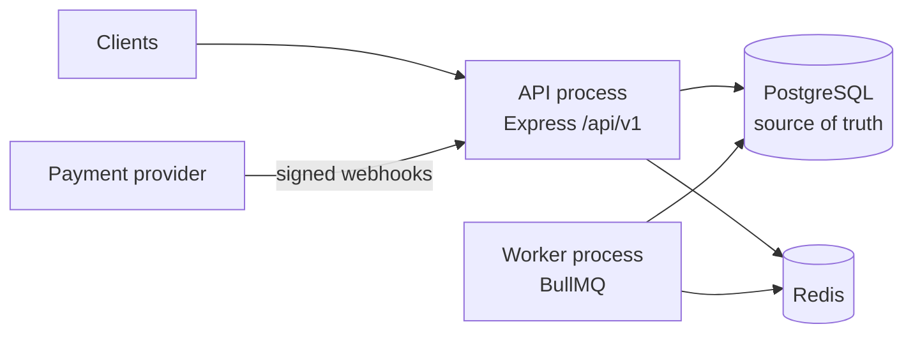

# Fundra

A production-style fintech backend for a digital NGN wallet platform. It is built around a **double-entry ledger**, so every balance can be explained, every money movement is atomic and idempotent, and duplicate webhooks or concurrent requests can't create or lose money.

Built with Node.js, TypeScript, Express, PostgreSQL, Prisma, Redis and BullMQ as a modular monolith.

> **Status: design complete, implementation not started.** See [Status](#status).

---

## What it does

```text
Register → Verify email/phone → KYC → Wallet → Fund → Transfer / Pay → Withdraw → History
```

| Area | Capabilities |
|---|---|
| Auth | Registration, login/logout, JWT access tokens, rotating refresh tokens with reuse detection, email/phone verification, password reset, sessions and devices |
| KYC | Profiles, documents, status lifecycle, admin review, pluggable `KycProvider` (mock first) |
| Wallets & ledger | NGN wallets (multi-currency ready), double-entry ledger, holds, available vs ledger balance, reconciliation |
| Money movement | P2P transfers, deposits, withdrawals, payments, refunds, reversals, fees, all idempotent |
| Payments | Pluggable `PaymentProvider` (mock first, Paystack/Flutterwave sandbox later), signed and deduplicated webhooks |
| Platform | Beneficiaries, async notifications (BullMQ), audit log, RBAC admin API |

Full requirements are in [docs/PROJECT.md](docs/PROJECT.md).

---

## Technology stack

Versions are exactly as installed.

| Concern | Technology | Version |
|---|---|---|
| Runtime | Node.js (LTS) | 24.21.0 |
| Language | TypeScript (strict) | 6.0.3 |
| HTTP | Express | 5.2.1 |
| Database | PostgreSQL | *not yet provisioned* |
| ORM | Prisma + `@prisma/adapter-pg` | 7.10.0 |
| Validation | Zod | 4.6.5 |
| JWT | jose | 6.2.12 |
| Password hashing | argon2 (Argon2id) | 0.45.1 |
| Cache / queues | Redis via ioredis · BullMQ | 6.0.0 · 6.3.11 |
| Logging | Pino · pino-http · pino-pretty (dev) | 10.3.1 · 11.0.0 · 13.1.3 |
| HTTP security | helmet · cors | 8.3.0 · 2.8.6 |

Planned but not yet installed: ESLint, Prettier, Vitest, Supertest, Testcontainers, OpenAPI tooling, Docker, GitHub Actions.

Why TypeScript 6 and Prisma 7 rather than the newest majors: see [CASE_STUDY.md §5.1](docs/CASE_STUDY.md#51-latest-isnt-always-stable).

---

## Architecture at a glance



- **Ledger first:** balances are projections of immutable, balanced ledger entries.
- **Atomic and concurrency-safe:** one DB transaction per money movement, wallets locked in a fixed order.
- **Idempotent:** an `Idempotency-Key` stored in PostgreSQL alongside the money movement; webhooks deduplicated by event ID.
- **Reliable async:** a transactional outbox feeds BullMQ workers.

Details in [docs/ARCHITECTURE.md](docs/ARCHITECTURE.md).

---

## Project structure

```text
src/
├── config/        environment, database, redis, logger
├── common/        errors, types, utils, validators, constants
├── middleware/    auth, error, rate-limit, request-id, validation
├── modules/       auth · users · kyc · wallets · ledger · transactions · transfers
│                  payments · beneficiaries · notifications · webhooks · audit · admin
├── jobs/          BullMQ queues and workers
├── routes/        /api/v1 router
├── app.ts         Express app
└── server.ts      entry point
prisma/            schema, migrations, seed
tests/             unit · integration · e2e
docs/              project definition, architecture, case study, API, security
```

---

## Status

| Step | State |
|---|---|
| Requirements | Done ([PROJECT.md](docs/PROJECT.md)) |
| Architecture | Done ([ARCHITECTURE.md](docs/ARCHITECTURE.md)) |
| Dependencies | Installed |
| Module scaffold | Done; files hold responsibility comments only |
| Database/ERD, ledger design, API spec | Next |
| TypeScript config, scripts, Prisma config | Not started |
| Docker, PostgreSQL, Redis | Not started (Docker not installed yet) |
| Modules, tests, CI, deployment | Not started |

Known gaps are listed in [ARCHITECTURE.md §13](docs/ARCHITECTURE.md#13-known-debt-and-current-gaps).

---

## Getting started

Requires **Node.js 24 LTS**.

```bash
git clone <repo-url> fundra
cd fundra
npm install
```

`npm install` runs the install scripts approved in `package.json` (`allowScripts`) for argon2 and Prisma.

There is nothing to run yet. Commands for starting PostgreSQL and Redis, running migrations, and starting the API, workers and tests will be added here as each piece is built.

Configuration lives in a local `.env` file, which git ignores. Required variables will be validated at startup by `src/config/env.ts`.

---

## Documentation

| Document | Contents |
|---|---|
| [PROJECT.md](docs/PROJECT.md) | What Fundra is, its requirements and scope |
| [ARCHITECTURE.md](docs/ARCHITECTURE.md) | System design, ledger, flows, data model, security, known debt |
| [CASE_STUDY.md](docs/CASE_STUDY.md) | Problem, decisions, challenges and trade-offs |
| [api.md](docs/api.md) | Endpoint reference (filled in per module) |
| [security.md](docs/security.md) | Security controls (filled in per module) |

---

## License

Not yet chosen. `package.json` currently has npm's default `ISC`.
