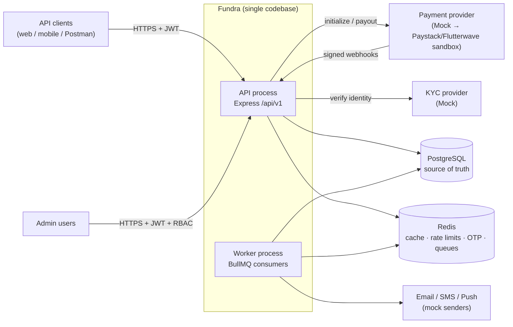
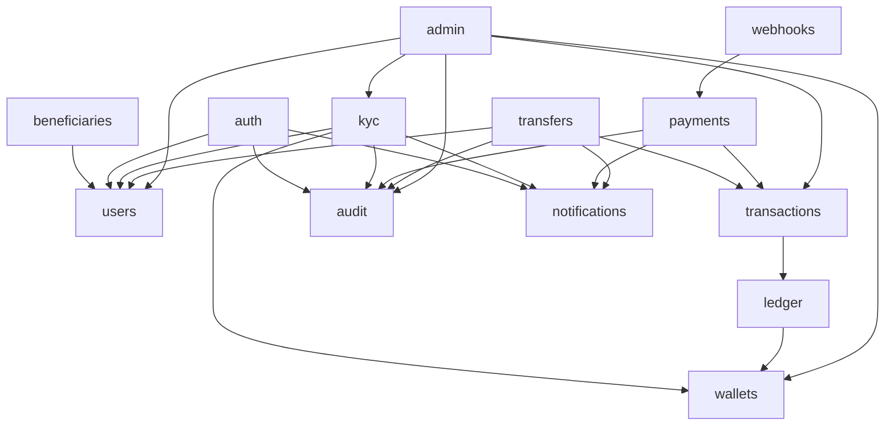
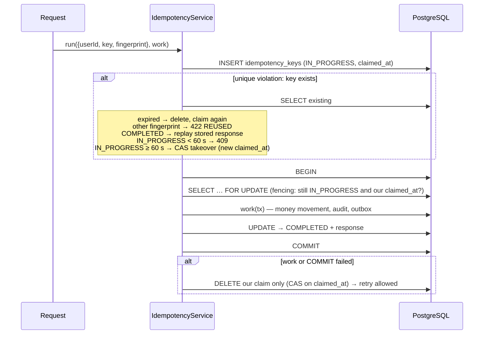
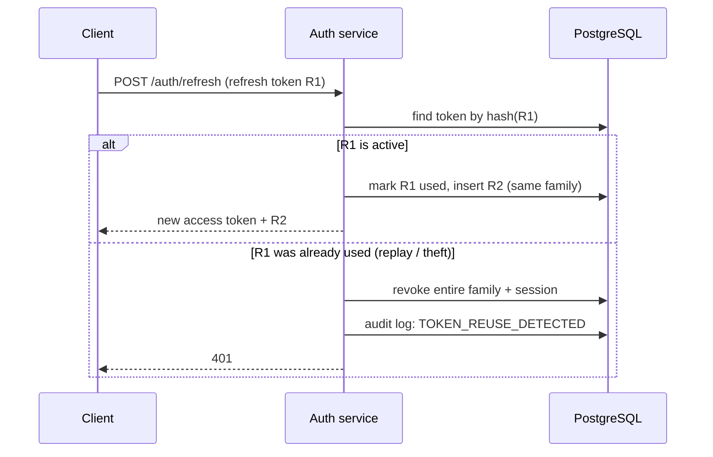
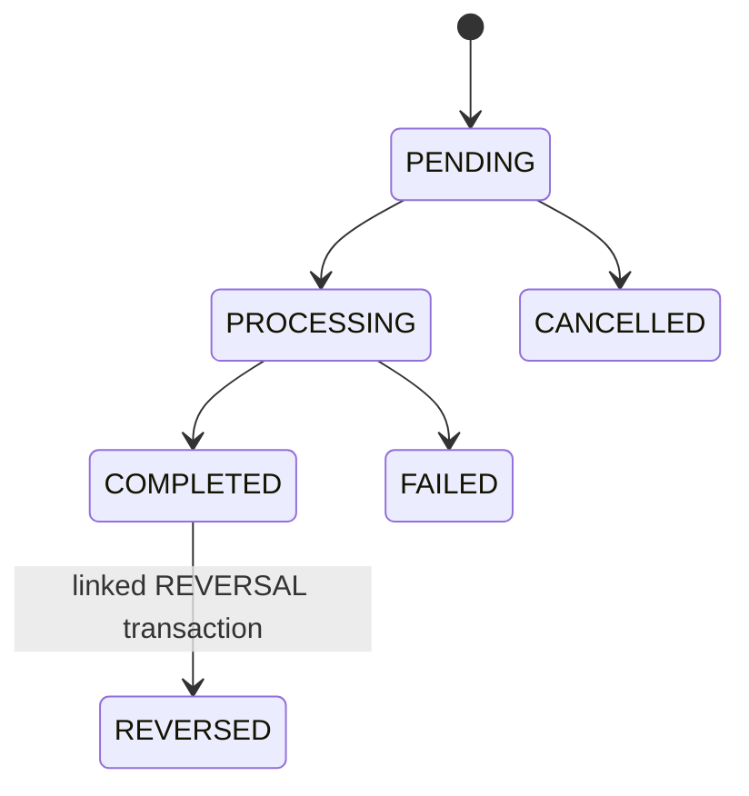
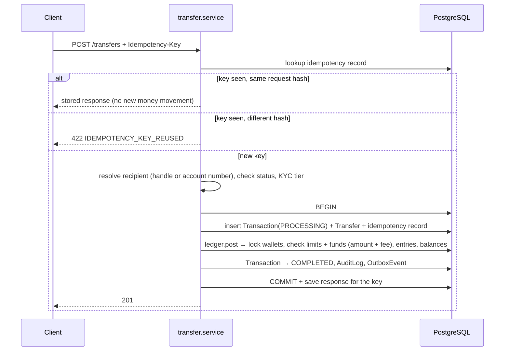
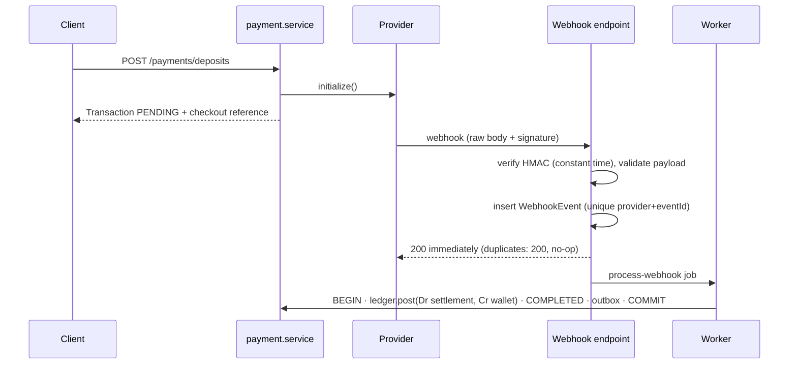
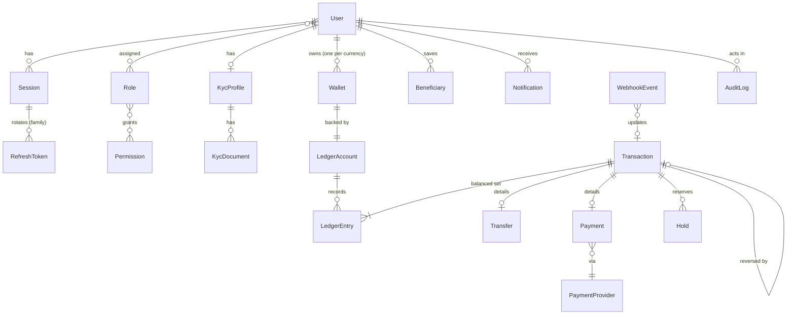

# Fundra — Architecture

> How Fundra is structured and why: system context, repository layout, layering rules, request and auth lifecycles, the double-entry ledger, the data model and known debt. Written for engineers working on or reviewing the codebase. Requirements live in [PROJECT.md](PROJECT.md); the narrative is in [CASE_STUDY.md](CASE_STUDY.md).

**Status as of 2026-10-01:** the design is complete. Tooling is set up, and implementation has begun with validated configuration and logging (Stage 4); progress is tracked in [ROADMAP.md](ROADMAP.md). Each section is labelled as follows:

| Label | Meaning |
|---|---|
| **Built** | Exists in the repository and works |
| **Scaffolded** | Files exist but contain only a responsibility comment |
| **Designed** | Decided here; no code yet |

---

## 1. System context — *Designed*



Fundra is a **modular monolith** that runs as **two processes from one build**:

- **API process** (`src/server.ts`) handles HTTP and never does slow work inline.
- **Worker process** (`src/jobs/workers.ts`) consumes BullMQ jobs: notifications, webhook processing, the outbox relay, reconciliation and statements.

Both processes import the same module services, so every business rule exists in exactly one place.

**Why a monolith:** one PostgreSQL transaction can cover the wallet, ledger, transaction, audit and outbox writes. That gives atomicity without distributed transactions, which matters more in a financial system than scaling each part independently. Module boundaries keep a later split possible.

---

## 2. Repository topology — *Scaffolded*

```text
fundra/
├── src/
│   ├── config/        env.ts · database.ts · redis.ts · logger.ts
│   ├── common/        constants/ · errors/ · types/ · utils/ · validators/
│   ├── middleware/    auth · error · rate-limit · request-id · request-logger · security · validation
│   ├── modules/       13 feature modules (see §4)
│   ├── jobs/          queues.ts · workers.ts · jobs/
│   ├── routes/        index.ts  (mounts module routers at /api/v1)
│   ├── app.ts         Express app assembly
│   └── server.ts      process entry, graceful shutdown
├── prisma/            schema.prisma · migrations/ · seed.ts
├── tests/             unit/ · integration/ · e2e/
└── docs/              PROJECT · ARCHITECTURE · CASE_STUDY · api · security
```

There are 69 TypeScript files under `src/` and `prisma/`. Each contains a single comment stating its responsibility; none contains code yet.

Planned additions, created when the relevant module is built:

| Path | Purpose |
|---|---|
| `src/modules/kyc/providers/` | `KycProvider` interface + `MockKycProvider` |
| `src/modules/payments/providers/` | `PaymentProvider` interface + `MockPaymentProvider` |
| `src/modules/payments/payment.schema.ts` | Zod schemas (missing from the initial layout) |
| `src/common/idempotency/` | Idempotency service + middleware |
| `src/common/outbox/` | Transactional outbox writer |

---

## 3. Layers and dependency rules — *Designed*

```text
routes → middleware → controller → service → (repository) → Prisma → PostgreSQL
                                      └──→ other modules' services
```

| Layer | Responsibility | Must not |
|---|---|---|
| `*.routes.ts` | Map method + path to a middleware chain and controller | Contain logic |
| `*.schema.ts` | Zod schemas for body, query, params and responses, built from `src/common/validators` (`amount`, `currency`, `uuid`, `pagination`) | Touch the database |
| `*.controller.ts` | Read the validated input, call one service method, shape the response | Contain business rules or open DB transactions |
| `*.service.ts` | Business rules, orchestration, transaction boundaries | Know about `req` / `res` |
| `*.repository.ts` | Complex persistence only (raw SQL, row locks) | Contain business rules |

**Rules**

1. **Modules talk through services, never through each other's tables.** For example, `transfers` calls `ledger.service`; it never inserts ledger entries itself.
2. **`ledger.service` is the only code that writes ledger entries or changes wallet balances.** It is the single enforcement point for "debits = credits".
3. **The orchestrating service owns the transaction boundary.** It opens a Prisma interactive transaction and passes the transaction client (`tx`) down.
4. **Dependencies point downward and are never circular.** Ledger, audit and wallets never import transfers, payments or admin.
5. **Only `config/env.ts` reads `process.env`.** Everything else imports typed config. ESLint enforces this (`no-restricted-properties`).
6. **Repositories only where they earn their place.** Most services use Prisma directly. The ledger has a repository because it needs `SELECT … FOR UPDATE`, which Prisma's query API does not provide.



---

## 4. Modules — *Scaffolded*

| Module | Responsibility | Owns |
|---|---|---|
| auth | Register, login, logout, tokens, rotation, verification, password reset, sessions, devices | Session, RefreshToken |
| users (*Built*: profile, contacts, preferences, status, deactivation; see [§6.1](#61-users--built)) | Profile, contacts, preferences, status, deactivation | User |
| kyc | KYC profile, documents, provider abstraction, status lifecycle, tiers and limits | KycProfile, KycDocument |
| wallets | Wallet lifecycle (created on KYC approval), status, balance reads | Wallet |
| ledger | Balanced postings, ledger accounts, holds, integrity | LedgerAccount, LedgerEntry, Hold |
| transactions | Central record, references, status machine, history | Transaction |
| transfers | P2P orchestration | Transfer |
| payments | Deposits, withdrawals, payments via `PaymentProvider` | Payment, PaymentProvider |
| webhooks | Receive, verify, dedupe, persist, dispatch | WebhookEvent |
| beneficiaries | Saved recipients | Beneficiary |
| notifications | Records + async delivery | Notification |
| audit | Append-only audit trail | AuditLog |
| admin | RBAC-protected admin use cases over other modules | Role, Permission (shared with auth) |

---

## 5. Request lifecycle — *Partly built*

Middleware order in `app.ts`:

| # | Stage | Status | Why here |
|---|---|---|---|
| 1 | `requestId` | Built | Every later log line and error carries the ID. A caller's `X-Request-Id` is reused only if it matches `[A-Za-z0-9._:-]{1,128}`; otherwise a UUID is generated, which blocks log injection |
| 2 | `requestLogger` (pino-http) | Built | One line per request (method, URL, status, duration; no headers). `error` for 5xx with the real error and stack, `warn` for 4xx, `info` otherwise; `/health*` is not logged |
| 3 | `securityHeaders` (helmet) | Built | Security headers on every response, errors included; removes `X-Powered-By` |
| 4 | `corsPolicy` | Built | Exact-origin allow-list from `CORS_ORIGINS`, empty by default (no browser origin allowed). Allows the `Authorization`, `Idempotency-Key` and `X-Request-Id` headers; exposes `X-Request-Id`, `RateLimit-*` and `Retry-After` |
| — | `/health` router | Built | Mounted here so probes skip rate limiting and body parsing |
| 5 | `rateLimit` (global `api` policy) | Built | 300 requests/min per client IP, *before* body parsing so rejected requests cost nothing to parse (details below) |
| 6 | **webhooks router** | Stage 15 | Mounted **before** JSON parsing: signature checks need the raw bytes |
| 7 | `jsonBody` | Built | `express.json` with a 100 kB limit; malformed JSON → 400, oversized → 413 |
| 8 | `/api/v1` router | Per module | Per route: `authenticate → rateLimit(policy) → authorize(permission) → validated(schemas, handler)` |
| 9 | `notFoundHandler` | Built | Unmatched routes get the standard `NOT_FOUND` body |
| 10 | `errorHandler` | Built | `normalizeError` → `errorBody`; for 5xx it hands the real error to the request logger (`res.err`), so each failure is logged once, with request context |

Implementation: [src/middleware/](../src/middleware/).

### Idempotency (*Built*)

Money-moving handlers run through `IdempotencyService.run(request, work)` ([src/common/idempotency](../src/common/idempotency/)). The client-facing contract is in [api.md](api.md#idempotency).

**Invariant:** the idempotency row is marked `COMPLETED` *in the same database transaction* as the money movement. So "money moved" and "key completed" can never disagree, and an `IN_PROGRESS` row always means nothing has committed.



| Failure | Why it's safe |
|---|---|
| Client retries after a timeout | The key is `COMPLETED`, so the stored response is replayed and the work doesn't run |
| Work throws, or COMMIT fails (e.g. unbalanced ledger) | Nothing committed; the claim is released, so a retry runs |
| Process crashes mid-request | Its claim stays `IN_PROGRESS` with no money moved; after the 60 s lease, a retry takes over |
| A slow original wakes up after a takeover | The fencing check at the start of its transaction sees a different `claimed_at` and aborts before touching money. If the original already holds the row lock, the takeover waits for its COMMIT and then replays |
| COMMIT succeeds but the acknowledgement is lost | The row is `COMPLETED`, so the cleanup's compare-and-swap doesn't delete it; a retry replays |
| Response body contains a `bigint` | The JSON round-trip fails before COMMIT, so no money moves without a replayable response |

**Verified (2026-10-02)** through the real Prisma client on PostgreSQL 18.3 (pglite-socket), 20 of 21 scenarios: first run and replay, reused key (422), work failure releases the key, COMMIT failure (unbalanced ledger) persists nothing, stale takeover, **fencing** (a gated "slow original" was rejected and the takeover executed exactly once), expiry, and a bigint response failing before COMMIT. **Not verifiable on PGlite:** true concurrency. PGlite is single-connection; its socket multiplexer dropped 10 of 20 simultaneous connections. Even then, exactly one execution happened. Real concurrent transactions and row-lock waits are tested in the Stage 6 Testcontainers suite. The optional Redis "in-progress lock" from §9.3 isn't needed: the unique row claim is the lock.

### Validation (*Built*)

Handlers are wrapped in `validated(schemas, handler)`, so they only run with valid input:

```ts
router.post('/transfers', authenticate, validated(
  { body: transferBody },                  // Zod schemas for params / query / body
  async ({ body }, req, res) => { ... },   // body.amount is already a bigint
));
```

- **A wrapper, not a middleware that rewrites `req`:** Express 5 makes `req.query` read-only, and values written back onto `req` would be untyped anyway. The wrapper passes parsed, transformed values to the handler, typed from the schemas. A type-level test confirms this, and unchecked locations are typed `undefined`.
- **All problems in one response:** failures in `params`, `query` and `body` are collected into a single `422 VALIDATION_ERROR` with location-prefixed paths (`body.amount`), so clients fix everything in one round trip. Submitted values are never echoed back.
- Shared building blocks live in [src/common/validators](../src/common/validators/index.ts). Object schemas use `z.strictObject`, so unknown fields are rejected. The full client-facing rules are in [api.md](api.md#input-rules).

### Rate limiting (*Built*)

- **Algorithm:** fixed window per key, run in Redis as one Lua script (`INCR`, plus `PEXPIRE` on the first hit), so concurrent requests can't race past the count. A counter that lost its TTL is repaired instead of blocking its subject forever.
- **Keys:** `rl:<policy>:<subject>`. The default subject is the client IP from `req.ip`, which honours `TRUST_PROXY_HOPS`. IPv4-mapped IPv6 is normalised to IPv4, and **IPv6 clients are grouped by /64**, because one user usually controls a whole /64 and could otherwise rotate addresses. Policies can key by user ID instead (auth, Stage 7).
- **Responses:** `RateLimit-Limit`, `RateLimit-Remaining` and `RateLimit-Reset` (seconds) on every limited response; `429 RATE_LIMITED` with `Retry-After` when exceeded.
- **Redis outages:** policies **fail open** by default. One Redis outage shouldn't take the API down, and abuse-sensitive flows have further layers (database login lockouts). A policy can set `failOpen: false` to answer `503` instead. The Redis client logs each outage once, and per-request fail-open notes are `debug` only.
- **Redis client** (`src/config/redis.ts`): `enableOfflineQueue: false`, so commands fail immediately while disconnected and no request hangs on Redis. It reconnects in the background with backoff capped at 5 s, and connects at startup (`lazyConnect`), so importing it in tests opens no connection.
- **Verified:** 21 unit tests (memory store, middleware, IPv6 grouping, fail-open/closed). The **exact Lua script** was run through ioredis-mock's Lua engine: counting, expiry, TTL repair, and 50 concurrent hits producing counts 1–50 exactly once. The real server with Redis unreachable served every request and logged the outage once. **Not yet verified against a real Redis server** (Docker; Stage 6 integration tests).

---

## 6. Authentication lifecycle — *Built (login, refresh, logout)*

Implementation: [src/modules/auth](../src/modules/auth/) (`tokens.ts`, `auth.service.ts`). Endpoint contracts: [api.md](api.md#auth).

| Element | As built |
|---|---|
| Access token | HS256 JWT (`jose`): `sub` user, `sid` session, `roles`, `iss`/`aud` = `fundra-api`, 15 min. Verification accepts **only** HS256 (rejects `alg: none` and algorithm swaps) and checks issuer, audience and expiry. Key: `JWT_ACCESS_SECRET` (≥32 chars) |
| Refresh token | `fnd_rt_` + 256 random bits (the prefix helps secret scanners); only its SHA-256 is stored |
| Session | One row per sign-in: device ID/name, user agent, IP; absolute expiry 30 days, which rotation never extends |
| Rotation | Compare-and-swap (`used_at IS NULL`) consumes the token, issues its successor, and links them (`replaced_by_id`) in one transaction |
| Reuse detection | Two independent layers. A token already marked used is rejected up front, and a concurrent use that slips past that loses the compare-and-swap. Either way: session revoked (`TOKEN_REUSE`), audited as `auth.token_reuse_detected`, `401 REFRESH_TOKEN_REUSED` |
| Logout | Revokes the session (`LOGOUT`); always 204 |
| Disabled users | A refresh by a suspended or deactivated user revokes the session and returns 403 |
| Unverified users | `PENDING_VERIFICATION` may sign in, in order to verify; money endpoints will require `ACTIVE` |

Verified over HTTP on PostgreSQL 18.3 (23/23 checks), including replay detection killing the whole token family, idempotent logout, and two simultaneous refreshes never both succeeding. True concurrency on real PostgreSQL waits for the Stage 6 integration suite.

| `authenticate` middleware (*Built*) | `Authorization: Bearer <jwt>` → verify the token, then **load the session on every request** (one primary-key query that also loads the user, their status and their roles). Revoked or expired sessions, tokens issued before the last password change, and a session belonging to another user give `401 UNAUTHENTICATED`. Suspended users get `403`. An expired token gives `401 ACCESS_TOKEN_EXPIRED`, a distinct code so clients know to refresh. Every 401 carries `WWW-Authenticate: Bearer`. Sets `req.auth`; request log lines then carry `userId` |
| One-time codes (*Built*) | 6 digits (`crypto.randomInt`), stored in Redis **only as HMAC-SHA-256** keyed with `OTP_SECRET` and bound to purpose + user; 10-minute TTL; max 5 attempts, then the code is destroyed; single use; 60 s resend cooldown (`SET NX PX`). Check and count happen in **one Lua script**, so concurrent guesses can't share attempts (20 parallel wrong guesses → exactly 5 counted, on ioredis-mock's Lua engine). Codes reach users only via `MessageSender` (in memory until Stage 17) and are never logged or stored in the database: the outbox isn't used because its rows persist |
| Verification (*Built*) | `/auth/verify/{email,phone}/{request,confirm}` (authenticated). When both are verified, `PENDING_VERIFICATION` → **`ACTIVE`** |
| Password reset (*Built*) | `/auth/password/forgot` always 202 (unknown or disabled accounts are never revealed; the code goes to the channel named by the identifier). `/auth/password/reset`: the personal-data policy is checked *before* the code is consumed; on success, new Argon2id hash, `password_changed_at` = now, **every session revoked**, lockout cleared, audited, `auth.password_changed` outbox event, alert email. 5 per 15 min per IP |
| Sessions & devices (*Built*) | `GET /auth/sessions`, `DELETE /auth/sessions/:id` (another user's ID → 404), `DELETE /auth/sessions` (all except the current one). Login flags `newDevice` in the `auth.login_succeeded` event when the `deviceId` hasn't been seen for that user |

**Revocation is immediate.** Because `authenticate` checks the session per request, logout, remote sign-out and theft revocation stop the access token at once, instead of after up to 15 minutes. That costs one indexed lookup per request; a short Redis cache can be added if profiling ever shows a need. Verified over HTTP on PostgreSQL 18.3 (19/19), including a revoked device's token being rejected on its very next request.

The original design notes follow.

Access tokens are short-lived JWTs (about 15 minutes) carrying only the user ID, session ID and roles. Refresh tokens are **opaque random values stored hashed**, grouped into one **family per session**, and **rotated on every use**.



Why reuse detection: if an attacker and the real user both hold R1, whoever refreshes second reveals the theft. Revoking the whole family logs both out, which limits the damage. Rotation without reuse detection adds very little security.

Other auth details:
- Passwords are hashed with Argon2id.
- OTPs are hashed in Redis with a TTL and a maximum number of attempts.
- Each login creates a Session row with device, IP and user agent, which the user can list and revoke.

### 6.1 Users — *Built*

Everything under `/api/v1/users/me` acts on the signed-in user. Endpoints are listed in [api.md](api.md#users-the-signed-in-user).

| Concern | Design |
|---|---|
| Status lifecycle | One transition table ([user-status.ts](../src/modules/users/user-status.ts)) that every status change goes through. `PENDING_VERIFICATION → ACTIVE` when both contacts are verified; any live status → `SUSPENDED` (admin) or `DEACTIVATED`; reactivation is an admin action. `ACTIVE` never goes back to `PENDING_VERIFICATION`, because a verified contact is only ever replaced by another verified one |
| Profile | Name and handle are editable. The name **locks once KYC is submitted**: it's what KYC verifies, and what a sender sees when confirming a recipient. The lock is read with `SELECT … FOR SHARE` on the KYC row, so a concurrent submission can't slip a name change past the check. Only fields that change are written and audited, and names are never put in audit metadata |
| Re-authentication | Contact changes and deactivation need the password (`AuthService.confirmPassword`). This shares login's lockout, so a stolen access token can't be used to guess the password. A wrong password is `403 INCORRECT_PASSWORD`, not 401, so clients don't react by refreshing or signing out |
| Contact change | Request (password) → a code goes to the **new** address → confirm. The code's HMAC includes the new address, so a code sent to one address can't confirm another (a deliberate code break proved this matters: without the binding, the account's email moved to an attacker's address). The new address is saved as verified, which can complete activation. The **old** address is alerted, and the audit log keeps masked addresses only. An address that belongs to another account gets the same 202 and the same cooldown, but no code is sent |
| Preferences | Notification channels per category in `users.preferences` (jsonb), defined by a Zod schema. Reads fill in defaults and drop retired keys. PATCH takes a strict deep-partial and merges under `SELECT … FOR UPDATE`, so concurrent updates don't overwrite each other. Security emails can't be disabled; marketing is opt-in |
| Password change | `POST /users/me/password` (`AuthService.changePassword`, because auth owns sessions and tokens). Checks the current password (shared lockout), then the new-password rules: policy, not personal, not the same as the current one. One transaction saves the hash and `password_changed_at`, revokes **every** session including the current one (`PASSWORD_CHANGED`), and opens a fresh session for this device with the same device ID and name. The response carries its tokens. Replacing the current session rather than keeping it means every earlier token dies, including this device's old refresh token (`INVALID_REFRESH_TOKEN`, without tripping reuse detection). `password_changed_at` rejects old access tokens as a second layer. A deliberate code break showed why revoking the sessions matters: with the old access tokens already rejected, the other device's refresh token could still mint new ones. Audited, outbox `auth.password_changed`, alert email |
| Deactivation | Password + **zero balance in every wallet** + **no pending or processing transaction** to or from the user. Locks the user row, then the wallets (in id order), and in one transaction: `DEACTIVATED`, wallets `CLOSED`, every session revoked, audit, `user.deactivated` outbox event. Nothing is deleted, and the email, phone and handle stay reserved. Money movement (Stage 11) must reject `CLOSED` wallets, so nothing can land after the check |

Verified over HTTP on PostgreSQL 18.3 (PGlite): 54/54 checks for item 1 and 23/23 for password change, plus six deliberate code breaks, each caught (no address binding, code sent to a taken address, no KYC name lock, no balance check, other sessions left alive after a password change, no "different from current" rule). PGlite serves every connection from a single backend, so the row-lock races (preferences, name lock, deactivation against a posting) wait for the real-PostgreSQL integration suite.

### 6.2 KYC — *Built*

KYC verification goes through the `KycProvider` interface ([kyc-provider.ts](../src/modules/kyc/providers/kyc-provider.ts)). The KYC service depends only on the interface. `MockKycProvider` implements it now; a sandbox provider later needs only a new adapter.

| Concern | Design |
|---|---|
| Identity numbers (Tier 2) | `verifyIdentityNumber` checks a BVN or NIN against the name and date of birth the user gave, and answers at once: `MATCH`, `MISMATCH` (which fields) or `NOT_FOUND` |
| Documents (Tier 3) | `submitDocumentCheck`, then `getDocumentCheck`: `PENDING` → `ACCEPTED` or `REJECTED` (with a reason). Async because real providers are; webhooks can plug in later. The result is input for the admin reviewer (`kyc:review`), not the decision |
| Data minimisation | Providers return a **verdict, never the record**. An adapter compares the record it receives with the shared `matchIdentity` rule and discards it, so Fundra never holds the provider's copy of a person |
| Name matching | One rule for every adapter ([identity-match.ts](../src/modules/kyc/providers/identity-match.ts)): case, accents and punctuation ignored; first and last name match in either order; middle names compared only when both sides have one; dates of birth must be equal |
| Outages | `KycProviderUnavailableError` (no identity number in the message). The attempt stays retryable; the service maps it to 503 |
| Duplicates | Each request carries Fundra's `reference` for the attempt; a repeated reference reuses the provider's check |
| Log safety | The number travels as `idNumber`, which is in `SENSITIVE_KEYS` (as are `bvn` and `nin`), so the logger and audit sanitizer redact it |
| Mock | Magic numbers drive it, like a payment sandbox: `00000000001` not found, `…02` name mismatch, `…03` date-of-birth mismatch, `…09` unavailable, any other 11 digits match. Documents are `PENDING` on the first lookup, then `ACCEPTED`; tests can force a rejection. It approves almost everyone, so it is allowed in every environment (the demo needs it) but is logged loudly at startup and recorded as provider `MOCK` on every decision |

Verified by unit tests (18): every magic number, the matching rule, the document lifecycle and repeat submissions, plus a deliberate code break (name order made significant), caught.

**Tiers and lifecycle.** Endpoints are listed in [api.md](api.md#kyc-identity-verification). Every status change goes through one table ([kyc-status.ts](../src/modules/kyc/kyc-status.ts)): `status` is the latest request, `tier` what's approved, and a rejection never lowers `tier`.

| Concern | Design |
|---|---|
| Tier 1 | Date of birth, 18+ by the Lagos calendar, on an `ACTIVE` account (email and phone verified). Approved at once, with no provider. The legal name locks from here |
| Tier 2 | The duplicate check comes first: the number's HMAC is compared with other profiles, which costs no provider call. Then the provider is called **outside** any transaction. The decision transaction locks the profile (`FOR UPDATE`) and re-checks that the tier hasn't moved; the name and date of birth can't have changed, because both are locked from Tier 1. On a match the number is stored AES-256-GCM-encrypted, with the profile ID as authenticated data so a ciphertext copied onto another profile won't decrypt, plus its HMAC (unique). On a rejection nothing about the number is stored. If the provider is down: 503, nothing saved, no stuck state |
| Tier 2 rejections | One generic reason for every cause (mismatch, not found, number on another account), so the API can't confirm whose BVN is whose. The real cause, and which fields mismatched, go to the audit log. The unique index on the HMAC is the backstop if two accounts race with the same number: the losing approval becomes a `DUPLICATE_IDENTITY` rejection |
| Documents | Raw body (`express.raw` on that route only, 5 MB, JPEG/PNG/PDF). The first bytes must match the `Content-Type` (415 otherwise), so an SVG or HTML file labelled `image/png` is refused. SHA-256 and size are stored. The storage key is server-generated (`<profileId>/<uuid>`) and checked against a pattern before touching disk. The file is written before the row and removed if the transaction fails. Re-uploading a type replaces the draft (`PENDING`) row, and the old file is deleted after commit; documents from earlier reviews stay as history |
| Storage | `DocumentStorage` interface: `LocalDocumentStorage` (a gitignored `KYC_STORAGE_DIR`, files `0600`, never served over HTTP, no overwrites) until S3 in Stage 25 |
| Tier 3 | ID document + utility bill + address → `PENDING` (queued for review); documents and address are frozen. The documents are also sent to the provider. If it's down the submission still succeeds, and the reviewer opening the case sends them |
| Review | Service methods now; admin endpoints in Stage 19. A reviewer **opens** a case (`PENDING → IN_REVIEW`, assigned to them, the provider's document result attached), then approves or rejects. Approval needs the provider to have **accepted** the documents (`KYC_PROVIDER_CHECK_INCOMPLETE` otherwise). A rejection carries a reason shown to the user. Nobody reviews their own KYC (`KYC_SELF_REVIEW`), whatever their role |
| Name lock (Stage 8 fix) | The lock used to follow `status` only, so a user approved at Tier 1 and then rejected at Tier 2 could rename themselves. It now follows `tier > 0`, or a submission under review |
| Records | Each decision writes an audit row (from/to status, tier, provider, cause; never a number, name or address) and a `kyc.status_changed` outbox event (`userId`, `status`, `tier`) in the same transaction. Stage 10 creates the wallet from that event |

**Tier limits** (D3; [tier-limits.ts](../src/modules/kyc/tier-limits.ts)). The lookup and the rules are here; money movement applies them inside its own transaction, under the wallet lock, with figures it read there (transfers in Stage 13, deposits and withdrawals in Stage 14).

| Concern | Design |
|---|---|
| Lookup | `findTierLimits(db, tier, currency)`: one primary-key read per transaction, no cache, so an admin's change applies to the next one. Tier 0 has no limits because it can't move money. A missing row for a verified tier **throws**: it never means unlimited; only an explicit `max_balance = NULL` does |
| Outflow | `checkOutflow`: **amount + fee** (what actually leaves the wallet) against the per-transaction limit, then against the daily limit with today's total. Today = the Africa/Lagos day ([business-day.ts](../src/common/utils/business-day.ts): 23:00–23:00 UTC, half-open). The total counts `TRANSFER`, `WITHDRAWAL` and `PAYMENT` in `PENDING`, `PROCESSING` or `COMPLETED`; failed, cancelled and reversed ones gave the money back. Exactly at a limit is allowed |
| Inflow | `checkInflow`: balance after the credit against `max_balance`, for deposits and incoming transfers. **Refunds and reversals are exempt**: returning a user's own money must never fail |
| Errors | The sender's own limits are theirs to see: the message names the limit and what's left today (`LIMIT_PER_TRANSACTION_EXCEEDED`, `LIMIT_DAILY_OUTFLOW_EXCEEDED`, `LIMIT_MAX_BALANCE_EXCEEDED` for a deposit). A transfer refused by the **recipient's** maximum is `RECIPIENT_CANNOT_RECEIVE`, revealing nothing about their tier, limit or balance |
| Display | `GET /kyc` → `limits.current` / `limits.next` per currency, kobo strings (D1) |
| No tier race | Tiers only rise (downgrades are out of scope), so an upgrade landing mid-transfer can only loosen a limit |

Limits are verified by 25 unit tests (boundaries to the kobo, fees, Lagos midnight, refunds, fail-closed lookup) and 9 checks on PostgreSQL 18.3 (seeded values per tier, an edit applying at once, the per-transaction-within-daily CHECK, a deleted row failing closed). Four deliberate code breaks were each caught: a missing row read as unlimited, a UTC day boundary, the fee left out, refunds not exempt.

Verified over HTTP on PostgreSQL 18.3 (PGlite): 59/59 checks, plus five deliberate code breaks, each caught by the check written for it: no HMAC pre-check, no magic-byte check, the old name-lock rule, no self-review guard, approval without provider acceptance. Two things wait for real PostgreSQL: the row-lock races, and the HMAC unique-index backstop. On PGlite's socket server, the first query after a failed transaction receives the previous query's response; a minimal Prisma-only script reproduces this, so it's the harness, not the KYC code.

### 6.3 Wallets — *Built*

| Concern | Design |
|---|---|
| When | With **Tier 1** approval (D3), inside `submitTier1`'s transaction ([wallet.service.ts](../src/modules/wallets/wallet.service.ts) `createWallet(tx, …)`). Approval and wallet commit together, so an approved user is never without a wallet, and nothing waits for the outbox relay (Stage 16). `kyc.status_changed` still goes to the outbox for notifications |
| What | One NGN wallet (`DEFAULT_CURRENCY`) and its own ledger account: `WALLET:<walletId>`, `LIABILITY` (a user's balance is money Fundra owes them), same currency, enforced by the composite foreign key. The ID comes from PostgreSQL first (`SELECT uuidv7()`) because the ledger code contains it. `ACTIVE`, both balances 0: only the ledger (Stage 11) changes them. Audit `wallet.created` with the wallet ID only |
| Once | An existing (user, currency) wallet is returned unchanged; the unique index refuses a second one even if the app check were missing (a deliberate break proved it). Tier 2/3 approvals don't create another |
| Account number | D2: 9 random digits (`crypto.randomInt`, not sequential, so one number reveals nothing about the next) + a **Damm** check digit ([account-number.ts](../src/modules/wallets/account-number.ts)). Damm catches every single-digit typo and every neighbouring swap (Luhn misses `09`↔`90`); `isValidAccountNumber` lets transfers (Stage 13) refuse a typo before any lookup. A taken number is skipped (up to 5 tries; 10⁹ possibilities); the unique index is the backstop for a simultaneous clash, which fails that approval cleanly. Never written to logs or audit records |

Verified on PostgreSQL 18.3 (PGlite): 15/15 checks, including atomicity proven by a fault injected **in the database** (a test-only trigger failing one user's wallet insert: the request is a 500, and the approval, audit row, outbox event and ledger account are all rolled back), the composite foreign key refusing an NGN wallet on a USD ledger account, and Stage 8 deactivation closing the new wallet. Three deliberate code breaks were each caught: the wallet created after the approval commits, a random check digit, no existing-wallet check. Unit tests check the Damm digit exhaustively: every single-digit change and every neighbour swap on 200 random numbers.


**Reading and status.** Endpoints are listed in [api.md](api.md#wallets).

| Concern | Design |
|---|---|
| Reading | `GET /wallets` and `GET /wallets/:id`, own wallets only. The query is scoped to `{ id, userId }`, so someone else's wallet is a **404 identical to a missing one** (no IDOR probing). Balances are the cached columns, kept in step with the ledger inside each posting's transaction (Stage 11) and reconciled in Stage 20; `onHold = ledger − available`. Kobo strings, `Cache-Control: no-store` |
| Lifecycle | One table ([wallet-status.ts](../src/modules/wallets/wallet-status.ts)): `ACTIVE ⇄ FROZEN`, `ACTIVE/FROZEN → CLOSED`, `CLOSED → ACTIVE` only through `reopen` after the account is reactivated (one wallet per user and currency, so a reactivated user needs theirs back). `changeWalletStatus` is the only way a status changes: the caller holds the row lock, and it writes the audit row and, optionally, the outbox event. Deactivation (Stage 8) now closes wallets through it too |
| FROZEN | A compliance or fraud hold: **no money in or out except reversals and refunds**, enforced by the ledger under the wallet lock (Stage 11). Incoming deposits to a frozen wallet are Stage 14's concern (e.g. parked in `SUSPENSE`) |
| Admin actions | `freeze` / `unfreeze` (reason required, 1–500 characters) and `reopen` are service methods; endpoints arrive in Stage 19 behind `wallets:freeze`. Lock order is user then wallet, the same as deactivation, so the two can't deadlock. Nobody changes their own wallet's status (`WALLET_SELF_ACTION`) |
| No tipping off | A freeze reason goes to the audit log **only**: never into the API response or the `wallet.status_changed` event. The owner sees `FROZEN` and is told to contact support |

Verified on PostgreSQL 18.3 (PGlite): 26 checks, plus the item 1 suite still passing after the deactivation change. Three deliberate code breaks were each caught: the ownership filter removed, the reason put in the event, the transition table bypassed. In that last break, `reopen`'s own guard still held for `CLOSED`.

---

## 7. Financial core — *Designed*

### 7.1 Money representation

Amounts are stored as **integer minor units (kobo)** in PostgreSQL `BIGINT` and handled as TypeScript `bigint`. Every amount carries an ISO 4217 currency code. JSON cannot represent `bigint`, so the API sends amounts as **strings of minor units** (`"1000000"` = ₦10,000.00; decision D1).

**Why not `number`:** `0.1 + 0.2 !== 0.3`, and values above 2^53 lose precision without warning. **Why not `DECIMAL`:** integer kobo makes it impossible to represent fractions of the smallest unit, and integer addition is exact.

### 7.2 Ledger model

From the platform's point of view, a user's balance is money Fundra **owes** that user. Wallet ledger accounts are therefore **liabilities** (credit-normal). System accounts provide the other side of postings that involve the outside world.

| Account | Type | Used for |
|---|---|---|
| `WALLET:<walletId>` | Liability | A user's funds |
| `PROVIDER_SETTLEMENT:<provider>` | Asset | Money held at / owed by a payment provider |
| `FEE_REVENUE` | Revenue | Fees charged |
| `SUSPENSE` | Liability | Money that can't yet be attributed; investigated by admins |

### 7.3 Invariants

| # | Invariant | Enforced by |
|---|---|---|
| 1 | Each transaction's entries sum to zero (Σ debits = Σ credits) | `ledger.service` + deferred constraint trigger at commit (*Built*: `ledger_entries_balanced`) |
| 2 | All entries in one transaction share one currency | `ledger.service` + check |
| 3 | Entries are never updated or deleted | DB triggers blocking `UPDATE`/`DELETE`/`TRUNCATE` (*Built*); corrections are new `REVERSAL`/`REFUND` postings |
| 4 | Entry amounts are strictly positive; direction carries the sign | `CHECK (amount > 0)` |

Each rule is enforced in both the application and the database. The application gives clear errors; the database guarantees the rule even if application code has a bug.

### 7.4 Example postings

| Operation | Debit | Credit |
|---|---|---|
| Deposit ₦10,000 | Provider settlement 10,000 | Wallet 10,000 |
| Transfer A → B ₦10,000 | Wallet A 10,000 | Wallet B 10,000 |
| Transfer with ₦50 fee | Wallet A 10,050 | Wallet B 10,000 · Fee revenue 50 |
| Withdrawal ₦5,000 (settled) | Wallet 5,000 | Provider settlement 5,000 |
| Reversal of a transfer | Wallet B 10,000 | Wallet A 10,000 |

### 7.5 Balances and holds

- **Ledger balance** = sum of the wallet's posted entries.
- **Available balance** = ledger balance − active holds.
- A **Hold** reserves funds for an in-flight operation, such as a withdrawal waiting for the provider. It is either settled into postings or released.
- The `Wallet` balance columns are **cached projections**, updated in the same transaction as the entries. The `reconcile-transactions` job recomputes them from the ledger and alerts on any drift.

### 7.6 Concurrency

A database transaction alone does not stop two simultaneous debits from both passing the balance check. Each posting therefore:

1. Runs inside a Prisma interactive transaction with a short timeout.
2. Locks the wallets involved with `SELECT … FOR UPDATE`, **in ascending wallet-ID order**, so opposing transfers (A→B and B→A) cannot deadlock.
3. Checks the available balance **after** the lock is acquired.
4. On a lock or serialization failure, retries a bounded number of times. This is safe because the request is idempotent.

### 7.7 Posting API

```text
ledger.post(tx, { transactionId, entries: [{ account, direction, amount }] })
  → validate invariants → lock wallets → check available funds
  → insert entries → update cached balances
```

### 7.8 Transaction state machine



Transitions are enforced by a transition table in `transaction.service`. References (`FND-TRX-YYYYMMDD-XXXXXX`) have a unique index and are regenerated on the rare collision.

---

## 8. Key flows — *Designed*

### 8.1 P2P transfer



### 8.2 Deposit via webhook



The **webhook decides the deposit's outcome**, never the client's redirect.

### 8.3 Withdrawal

1. Create the transaction (`PENDING`) and a **Hold**; available balance drops immediately.
2. Call `provider.payout()`.
3. Webhook success: post `Dr wallet / Cr settlement`, settle the hold, mark `COMPLETED`.
4. Webhook failure: release the hold and mark `FAILED`. Nothing is posted.

---

## 9. Asynchronous processing — *Designed*

### 9.1 Transactional outbox

If the API enqueued jobs right after committing, a crash between the commit and the enqueue would lose the notification. Enqueueing before the commit could announce work that is then rolled back. Instead:

1. The business transaction inserts an `OutboxEvent` row.
2. The `outbox-relay` job publishes unpublished rows to BullMQ and marks them published.

Delivery is therefore **at-least-once**, so every handler is idempotent and keyed by event ID.

**Writer (*Built*):** `writeOutboxEvent(tx, event)` in [src/common/outbox](../src/common/outbox/) returns the event ID, which is used as the BullMQ job ID.
- **Typed catalogue:** `OutboxEventPayloads` maps each event type (`transfer.completed`, `kyc.status_changed`, …) to its exact payload; an unknown type or wrong payload doesn't compile.
- **Minimal payloads:** they carry identifiers and facts, not personal data, and amounts are minor-unit strings. Consumers load names and contact details at send time.
- **Fails before COMMIT:** a non-JSON-safe or over-16 KB payload throws, so the business action rolls back rather than committing without its event.
- **Verified on PostgreSQL 18.3 via Prisma:** committed with its transaction; absent after a rollback (no phantom notification); and an idempotent retry replayed **without a second event**.

The relay that publishes events to BullMQ is Stage 16.

### 9.2 Queues

| Queue | Jobs |
|---|---|
| `notifications` | `send-email`, `send-sms`, `send-notification` |
| `webhooks` | `process-webhook` |
| `maintenance` | `outbox-relay`, `expire-otp`, `reconcile-transactions`, `generate-statement` |

Jobs retry a bounded number of times with exponential backoff. Jobs that keep failing stay in BullMQ's failed set for inspection.

### 9.3 PostgreSQL vs Redis

| Data | Store | Reason |
|---|---|---|
| Users, wallets, ledger, transactions, **idempotency records**, webhook events, audit, outbox | PostgreSQL | Must be durable and transactional together |
| Rate-limit counters, hashed OTPs, caches, in-progress locks, queues | Redis | Short-lived; safe to lose |

The brief lists idempotency keys under Redis. They are deliberately kept in **PostgreSQL**, in the same transaction as the money movement. A Redis-only key can disagree with the database after a crash, causing either a double charge or a stuck request. Redis is used only as an optional "request in progress" lock.

---

## 10. Data model — *Designed*

The full design (26 tables with every column, key, index, constraint and database-enforced rule) is in **[DATABASE.md](DATABASE.md)**. The overview below is the conceptual model it implements.



Constraints already decided:
- Unique case-insensitive `handle` on User (D2).
- Unique `(userId, currency)` and unique `accountNumber` on Wallet (D2).
- KYC tier on KycProfile; tier limits and the fee schedule stored as seeded data (D3, D6).
- Unique `reference` on Transaction.
- Unique `(userId, idempotencyKey)`.
- Unique `(provider, eventId)` on WebhookEvent.
- UUIDv7 primary keys: time-ordered for index locality, and not guessable, which prevents enumeration.

---

## 11. Security architecture — *Designed*

| Area | Control |
|---|---|
| Passwords (*Built*) | Argon2id, m=19 MiB t=2 p=1 (OWASP), ~50 ms per hash on the development machine. Hashes self-describe their parameters and are upgraded transparently on the next login when parameters change. Policy: 10–128 chars, not containing the handle or email name, no composition rules (NIST SP 800-63B) |
| Credential checks (*Built*) | One `INVALID_CREDENTIALS` for unknown account **and** wrong password; a dummy Argon2 verification equalises timing when the account doesn't exist (measured 122 ms vs 96 ms). 5 consecutive failures → 15-minute lock; while locked the password is **not checked at all**, so guessing during a lockout learns nothing. Suspended/deactivated is revealed only after a correct password. Failures and locks are audited |
| Registration (*Built*) | User (`PENDING_VERIFICATION`), tier-0 KYC profile, `USER` role and audit row in one transaction. A taken handle is reported (`HANDLE_TAKEN`); a taken email or phone is `ACCOUNT_EXISTS` without naming the field. Contact details are normalised (lower-case email, Nigerian local phone → E.164) so case or format can't create duplicates. Rate limited to 10/hour per IP |
| Tokens (*Built*) | 15-minute HS256 JWT access tokens (`jose`, algorithm pinned); `fnd_rt_` opaque refresh tokens stored as SHA-256, rotated on every use, with reuse detection that revokes the whole session; token responses sent `Cache-Control: no-store` (see §6) |
| Authorization (*Built*) | `authorize('kyc:review', …)` requires **every** listed permission. `Permission` is a type, so a misspelled permission doesn't compile. Roles are **loaded from the database on every request** (in `authenticate`'s session query, no extra round trip), so granting or revoking a role applies to an existing token on its next request; the token's `roles` claim is informational only. Role → permission mapping comes from `ROLE_PERMISSIONS` in code (the same constants the seed syncs to the database); unknown role names grant nothing. Denials are `403 FORBIDDEN` with a generic message; the missing permission is logged with `userId`, not revealed. `requireActiveAccount` (`403 ACCOUNT_NOT_ACTIVE`) gates money endpoints until email and phone are verified. Services still verify **resource ownership** (prevents IDOR) |
| Input | Zod on every endpoint via `validated()` (*Built*); `z.strictObject` rejects unknown fields; repeated query parameters rejected; amounts must be kobo strings (no floats) |
| Transport | Helmet, CORS allow-list, body size limits, explicit `trust proxy` |
| Abuse | Redis rate limits (*Built*: global 300/min per IP, IPv6 grouped by /64); stricter per-route policies on login, OTP, password reset and money movement as those modules are built |
| Webhooks | HMAC over the raw body, constant-time comparison, event-ID dedupe |
| Data | BVN/NIN encrypted at the application level; KYC documents in private storage |
| Logging | Pino redaction of passwords, tokens, OTPs, `authorization` headers and identity numbers (one shared key list with the audit sanitizer) |
| Audit trail (*Built*) | `recordAudit(tx, entry)` writes **in the caller's transaction**: an action and its audit row commit or roll back together, and a failed audit write fails the action. Actions are a typed `domain.event` catalogue; `USER`/`ADMIN` actors must carry a user ID and `SYSTEM` actors can't. Metadata is sanitized before storage (sensitive keys redacted case- and separator-insensitively at any depth; bigint to exact strings; circular, deep or >8 KB payloads capped), because audit rows are append-only by trigger and a leaked secret would be permanent. IP, user agent (≤512 chars) and request ID come from the request |
| Errors | Generic client messages; details only in logs, correlated by request ID |

Detailed controls will be documented in [security.md](security.md) as each module is built.

---

## 12. Cross-cutting conventions — *Designed*

**API**
- Base path `/api/v1`.
- Success envelope `{ data, meta }`; error envelope `{ error: { code, message, details, requestId } }`.
- Status codes: 200, 201, 202, 204, 400, 401, 403, 404, 409, 413, 422, 429, 500, 503.
- Cursor pagination for histories; filters and sorts restricted to whitelisted fields.
- `Idempotency-Key` required on money-moving `POST`s.
- OpenAPI generated from the Zod schemas.
- Endpoint contracts will be documented in [api.md](api.md).

**Errors (*Built*):** `AppError` subclasses in `src/common/errors/` carry a stable `code` from a single catalogue (`error-codes.ts`) and an HTTP status. Services throw them. `normalizeError()` converts anything else: Zod failures become `422 VALIDATION_ERROR` with field paths but no submitted values, body-parser failures become 400/413, and everything unknown becomes `500 INTERNAL_ERROR`, with the original kept as `cause` for logs only. `errorBody()` replaces 5xx messages with a generic one and drops their details, so internal information can't leak. Prisma errors will be translated at the service boundary (Stage 5). The full code table is in [api.md](api.md#error-codes).

**Configuration:** `config/env.ts` validates `process.env` with Zod at startup. The process refuses to start if config is missing or invalid.

**Observability and lifecycle (*Built*, except where noted):**
- **Logs:** JSON lines carrying `requestId`; `userId` is added with auth in Stage 7.
- **`GET /health/live`:** 200 `{ "status": "ok" }` while the process runs.
- **`GET /health/ready`:** runs the registered dependency checks in parallel, each with a 2 s timeout. It reports per-check `up`/`down` only; failure reasons go to the logs.

  | Status | HTTP | When |
  |---|---|---|
  | `ready` | 200 | Every check is up |
  | `degraded` | 200 | Only **non-critical** checks are down; keep serving |
  | `unavailable` | 503 | A **critical** check is down |
  | `draining` | 503 | Shutting down |

  | Check | Probe | Critical | Why |
  |---|---|---|---|
  | `database` | `SELECT 1` via the shared Prisma pool | yes | Nothing works without it |
  | `redis` | `PING` | **no** | Every instance shares one Redis, so failing readiness on it would pull *all* instances at once and turn a Redis blip into a full outage. Rate limiting fails open, so the API degrades rather than breaks. **Revisited in Stage 7 (OTPs): still non-critical.** A Redis outage breaks verification and password reset, which fail closed with a clear 503, while sign-in and (later) money movement keep working; pulling every instance would break those too. Revisit again for job queues (Stage 16) |

  The process starts even when a dependency is down and reports it until it recovers, so orchestrators hold traffic rather than crash-looping the app. Verified live:
  - PostgreSQL 18.3 down at startup, then up, died and recovered: 503 → 200 → 503 → 200 with no restart, one `warn` per failed probe.
  - Database up with Redis unreachable: `200 degraded`. Both down: `503 unavailable`.
- Health responses are infrastructure, not API: they aren't versioned, aren't wrapped in the envelope, are sent with `Cache-Control: no-store`, and aren't access-logged.
- **Graceful shutdown** (`src/common/utils/shutdown.ts`) on SIGTERM/SIGINT:
  1. Readiness reports `draining`.
  2. The server stops accepting connections; in-flight requests finish.
  3. Cleanup hooks run in order; a failing hook doesn't stop the others. Currently: **Redis** (`QUIT` when connected; a hard disconnect mid-outage, which also stops the reconnect loop that would otherwise keep the process alive), then the **database**. Queues are added first in Stage 16.
  4. The process exits 0.
  
  After 10 s the remaining connections are force-closed and the exit code is 1. A hung cleanup triggers a hard exit 5 s later. A second signal exits immediately. Uncaught exceptions and unhandled rejections are logged at `fatal` and go through the same path with exit code 1. If the port is taken at startup, it logs `fatal` and exits 1.
- **Windows note:** `kill`/`Stop-Process` terminate a Node process without delivering a signal. Graceful shutdown happens on Ctrl+C locally, and on SIGTERM from Docker and orchestrators.

**Testing:**

| Level | Tools | Focus |
|---|---|---|
| Unit | Vitest | Ledger invariants, fees, limits, state transitions, token logic |
| Integration | Vitest + Testcontainers (real Postgres + Redis) | Atomic postings, locking, idempotency, rollbacks |
| E2E | Supertest | register → KYC → fund → transfer → history |

A required concurrency test fires N parallel transfers at one wallet and asserts that no overdraft occurs and the ledger still balances.

---

## 13. Known debt and current gaps

This reflects the repository as it stands, not the design.

| Gap | Impact |
|---|---|
| Business modules beyond auth and users are placeholders | Their `/api/v1` paths return 404 until each stage mounts them |
| Deactivated accounts can't be reactivated yet | Reactivation is an admin action (Stage 19). It must reopen the `CLOSED` wallets too |
| Redis is a *non-critical* readiness check | Deliberate (re-decided in Stage 7): during a Redis outage, readiness says `degraded` while OTP flows return 503. Revisit for job queues (Stage 16) |
| Verification and reset codes aren't delivered yet | `MemoryMessageSender` holds them in memory until Stage 17 adds real email/SMS; the server logs a warning at startup. Tests read codes from the memory sender |
| Rate limiting hasn't run against a real Redis server | The Lua script was verified on ioredis-mock's Lua engine; real Redis 8.8 waits for Docker and the Stage 6 integration tests |
| ioredis 6 defaults to the RESP3 protocol | Fine for our commands on Redis 8. BullMQ's compatibility with ioredis 6 / RESP3 must be checked in Stage 16 |
| Graceful shutdown → `disconnectDatabase()` hasn't been exercised end-to-end | Windows can't deliver SIGTERM to a Node process. The cleanup hook ordering is unit-tested; a real SIGTERM test runs once the app is in Docker (Stage 23) |
| The init migration has only been run on PGlite (in-process PostgreSQL 18.3), not on the Docker database, and `prisma migrate` drift detection hasn't run (it needs a shadow database) | Low risk, same engine version, but `npm run db:migrate` against Docker is still the real test |
| The 49 migration checks (30 constraints + 19 triggers) live in throwaway scripts | They need porting to `tests/integration` with Testcontainers (Stage 6) to keep guarding future migrations |
| Ledger triggers can be disabled by a database superuser | They protect against application bugs, not a compromised DBA account. The app must run as a non-owner role (Stage 25) |
| `ledger_accounts.type`/`currency`/`code` can be changed with a plain `UPDATE` | Changing the type of an account that holds entries silently changes what its balance means. To be locked by a trigger in Stage 11 |
| A native PostgreSQL 16 Windows service (`postgresql-x64-16`) occupies port 5432 on the development machine, listening on all interfaces | Fundra's Docker database uses **5433** instead. That service is outside this project, but it's reachable from the local network |
| Docker isn't installed on the development machine; PostgreSQL and Redis aren't available | Integration work is blocked until they are set up |
| No `.env.example` (removed by choice) | New contributors can't see which variables are required; `config/env.ts` validation will be the only source of truth |
| No tests written yet; Testcontainers not installed (Stage 6) | `passWithNoTests` is on in `vitest.config.ts`, so empty test runs pass. Turn it off once every project has tests |
| `npm audit`: 4 high-severity advisories, all inside the `prisma` development tool (`mysql2`, `deepmerge-ts`) | Not shipped in the API runtime; npm's only fix is downgrading to Prisma 6, which was rejected |
| TypeScript held at 6.0.3, not 7.x | typescript-eslint supports TypeScript `<6.1.0` |

---

## 14. Decisions

Confirmed 2026-10-01 (Stage 1).

| # | Decision | Outcome |
|---|---|---|
| D1 | API amount format | Minor-unit integer **string**, e.g. `"1000000"` = ₦10,000.00 |
| D2 | Transfer recipient identifier | **Handle or account number.** The client sends either one, never the internal user ID |
| D3 | Transaction limits | **Per KYC tier** (1/2/3) |
| D4 | Admin accounts | Same `User` table with admin roles; MFA for admins later |
| D5 | Build order | Foundations early, as in [ROADMAP.md](ROADMAP.md); tests written with each stage |
| D6 | Fees | Posted in the **same ledger transaction** as the operation they belong to |
| — | License | MIT |

### D1 — Amounts

- The API accepts and returns amounts as strings matching `^[1-9][0-9]*$` (positive integer kobo, no decimals, no leading zeros), always alongside `currency`.
- Zod parses the string into a `bigint` at the edge; services never see strings or `number`s.
- Display formatting (₦10,000.00) is the client's job.

**Why:** exact for any size, survives JSON, and can't be silently rounded by a client's floating-point parser.

### D2 — Recipient

- **Handle:** a unique public `@handle` per user, chosen at registration. Stored lowercase and compared case-insensitively. 3–20 characters, `[a-z0-9_]`.
- **Account number:** a unique 10-digit number per wallet, generated by Fundra with a check digit, so typos are rejected instead of reaching a stranger.
- Transfer request: **exactly one** of the two fields (Zod enforces it):
  ```json
  { "recipientHandle": "emma", "amount": "1000000", "currency": "NGN", "description": "Lunch" }
  { "recipientAccountNumber": "0123456789", "amount": "1000000", "currency": "NGN" }
  ```
- A lookup endpoint returns only the recipient's display name, so the sender can confirm the recipient before sending. It is rate-limited to stop enumeration.

Handles identify a user; account numbers identify a specific wallet. When the handle is used, the transfer goes to the recipient's wallet in the request's currency.

### D3 — KYC tiers and limits

| Tier | Requirement | Per transaction | Daily outflow | Max balance |
|---|---|---|---|---|
| 1 | Verified phone + email, name, date of birth | ₦50,000 | ₦50,000 | ₦300,000 |
| 2 | Tier 1 + BVN or NIN | ₦100,000 | ₦200,000 | ₦500,000 |
| 3 | Tier 2 + ID document + address verification | ₦5,000,000 | ₦5,000,000 | Unlimited |

- The values are modelled on the CBN tiered-KYC framework and are **illustrative**. They are stored as data (seeded), not hard-coded, so admins can change them.
- The wallet is created when Tier 1 is approved.
- Limits are checked inside the transfer's DB transaction, so concurrent requests can't jointly exceed the daily limit. The max-balance check applies to the **recipient** on incoming money.

### D4 — Admins

Admins are `User` rows holding one or more admin roles (`SUPPORT`, `COMPLIANCE`, `FINANCE`, `ADMIN`, `SUPER_ADMIN`). Routes require permissions, never role names. Admin-only protections:
- stricter rate limits
- every action audit-logged
- MFA (planned)

### D6 — Fees

- A fee is extra entries in the **same** ledger transaction: `Dr sender (amount + fee) / Cr recipient (amount) / Cr FEE_REVENUE (fee)`.
- The fee and the operation therefore succeed or fail together, and the balance check covers `amount + fee`.
- Fee amounts come from a seeded fee schedule (initially ₦0 for P2P transfers), not code.
- The response and the transaction history show `amount`, `fee` and `total` separately.
