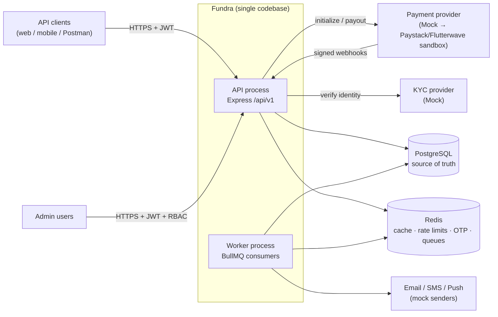
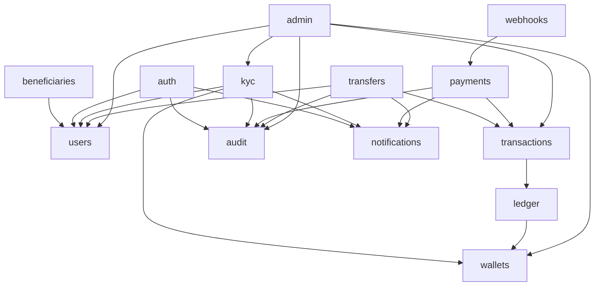
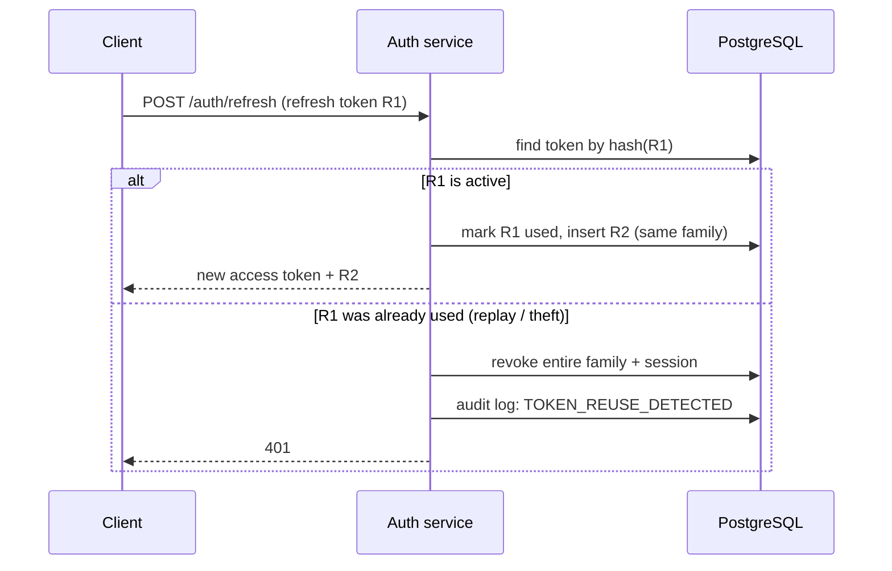
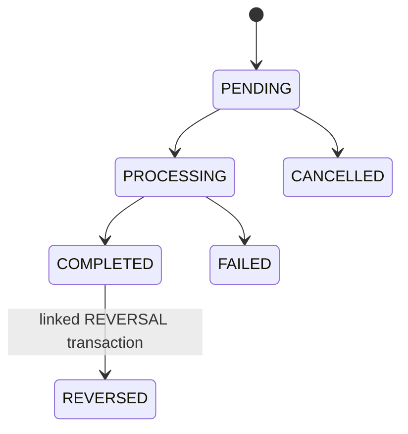
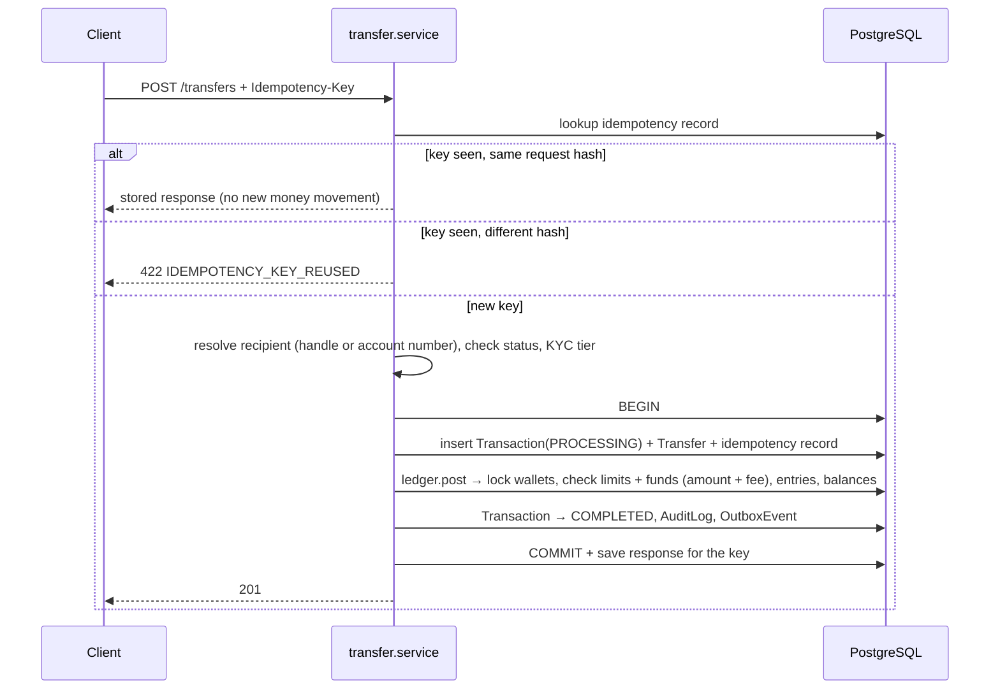
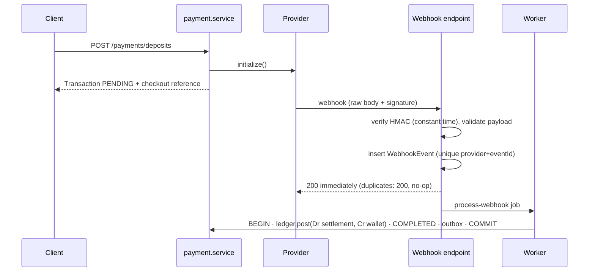
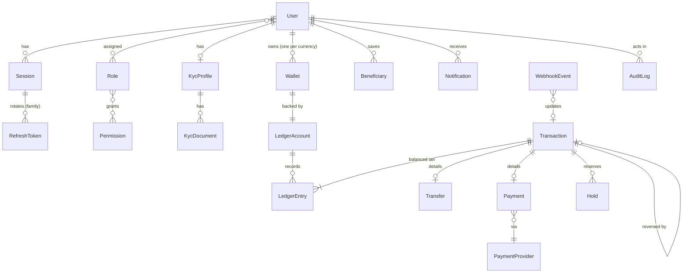

# Fundra — Architecture

> How Fundra is structured and why: system context, repository layout, layering rules, request and auth lifecycles, the double-entry ledger, the data model and known debt. Written for engineers working on or reviewing the codebase. Requirements live in [PROJECT.md](PROJECT.md); the narrative is in [CASE_STUDY.md](CASE_STUDY.md).

**Status as of 2026-10-01:** the design is complete; implementation has not started. Each section is labelled as follows:

| Label | Meaning |
|---|---|
| **Built** | Exists in the repository and works |
| **Scaffolded** | Files exist but contain only a responsibility comment |
| **Designed** | Decided here; no code yet |

---

## 1. System context — *Designed*



Fundra is a **modular monolith** that runs as **two processes from one build**:

- **API process** (`src/server.ts`) handles HTTP and never does slow work inline.
- **Worker process** (`src/jobs/workers.ts`) consumes BullMQ jobs: notifications, webhook processing, the outbox relay, reconciliation and statements.

Both processes import the same module services, so every business rule exists in exactly one place.

**Why a monolith:** one PostgreSQL transaction can cover the wallet, ledger, transaction, audit and outbox writes. That gives atomicity without distributed transactions, which matters more in a financial system than scaling each part independently. Module boundaries keep a later split possible.

---

## 2. Repository topology — *Scaffolded*

```text
fundra/
├── src/
│   ├── config/        env.ts · database.ts · redis.ts · logger.ts
│   ├── common/        constants/ · errors/ · types/ · utils/ · validators/
│   ├── middleware/    auth · error · rate-limit · request-id · validation
│   ├── modules/       13 feature modules (see §4)
│   ├── jobs/          queues.ts · workers.ts · jobs/
│   ├── routes/        index.ts  (mounts module routers at /api/v1)
│   ├── app.ts         Express app assembly
│   └── server.ts      process entry, graceful shutdown
├── prisma/            schema.prisma · migrations/ · seed.ts
├── tests/             unit/ · integration/ · e2e/
└── docs/              PROJECT · ARCHITECTURE · CASE_STUDY · api · security
```

There are 69 TypeScript files under `src/` and `prisma/`. Each contains a single comment stating its responsibility; none contains code yet.

Planned additions, created when the relevant module is built:

| Path | Purpose |
|---|---|
| `src/modules/kyc/providers/` | `KycProvider` interface + `MockKycProvider` |
| `src/modules/payments/providers/` | `PaymentProvider` interface + `MockPaymentProvider` |
| `src/modules/payments/payment.schema.ts` | Zod schemas (missing from the initial layout) |
| `src/common/idempotency/` | Idempotency service + middleware |
| `src/common/outbox/` | Transactional outbox writer |
| `src/modules/health/` | Liveness / readiness endpoints |
| `prisma.config.ts` | Required by Prisma 7 for datasource configuration |

---

## 3. Layers and dependency rules — *Designed*

```text
routes → middleware → controller → service → (repository) → Prisma → PostgreSQL
                                      └──→ other modules' services
```

| Layer | Responsibility | Must not |
|---|---|---|
| `*.routes.ts` | Map method + path to a middleware chain and controller | Contain logic |
| `*.schema.ts` | Zod schemas for body, query, params and responses | Touch the database |
| `*.controller.ts` | Read the validated input, call one service method, shape the response | Contain business rules or open DB transactions |
| `*.service.ts` | Business rules, orchestration, transaction boundaries | Know about `req` / `res` |
| `*.repository.ts` | Complex persistence only (raw SQL, row locks) | Contain business rules |

**Rules**

1. **Modules talk through services, never through each other's tables.** For example, `transfers` calls `ledger.service`; it never inserts ledger entries itself.
2. **`ledger.service` is the only code that writes ledger entries or changes wallet balances.** It is the single enforcement point for "debits = credits".
3. **The orchestrating service owns the transaction boundary.** It opens a Prisma interactive transaction and passes the transaction client (`tx`) down.
4. **Dependencies point downward and are never circular.** Ledger, audit and wallets never import transfers, payments or admin.
5. **Only `config/env.ts` reads `process.env`.** Everything else imports typed config.
6. **Repositories only where they earn their place.** Most services use Prisma directly. The ledger has a repository because it needs `SELECT … FOR UPDATE`, which Prisma's query API does not provide.



---

## 4. Modules — *Scaffolded*

| Module | Responsibility | Owns |
|---|---|---|
| auth | Register, login, logout, tokens, rotation, verification, password reset, sessions, devices | Session, RefreshToken |
| users | Profile, contacts, preferences, status, deactivation | User |
| kyc | KYC profile, documents, provider abstraction, status lifecycle, tiers and limits | KycProfile, KycDocument |
| wallets | Wallet lifecycle (created on KYC approval), status, balance reads | Wallet |
| ledger | Balanced postings, ledger accounts, holds, integrity | LedgerAccount, LedgerEntry, Hold |
| transactions | Central record, references, status machine, history | Transaction |
| transfers | P2P orchestration | Transfer |
| payments | Deposits, withdrawals, payments via `PaymentProvider` | Payment, PaymentProvider |
| webhooks | Receive, verify, dedupe, persist, dispatch | WebhookEvent |
| beneficiaries | Saved recipients | Beneficiary |
| notifications | Records + async delivery | Notification |
| audit | Append-only audit trail | AuditLog |
| admin | RBAC-protected admin use cases over other modules | Role, Permission (shared with auth) |

---

## 5. Request lifecycle — *Designed*

Middleware order in `app.ts`:

| # | Stage | Why here |
|---|---|---|
| 1 | `request-id` | Every later log line and error carries the ID |
| 2 | `pino-http` | Access log, with redaction |
| 3 | `helmet` | Security headers on every response, errors included |
| 4 | `cors` | Explicit origin allow-list |
| 5 | **webhooks router** | Mounted **before** JSON parsing: signature checks need the raw bytes |
| 6 | `express.json({ limit })` | Bounded body size |
| 7 | `rate-limit` | Redis-backed, per IP and per user; stricter on auth and money routes |
| 8 | `/api/v1` router | Per route: `authenticate → authorize(permission) → validate(schema) → controller` |
| 9 | 404 handler | |
| 10 | `error` middleware | Maps errors to the error envelope; never leaks internals |

---

## 6. Authentication lifecycle — *Designed*

Access tokens are short-lived JWTs (about 15 minutes) carrying only the user ID, session ID and roles. Refresh tokens are **opaque random values stored hashed**, grouped into one **family per session**, and **rotated on every use**.



Why reuse detection: if an attacker and the real user both hold R1, whoever refreshes second reveals the theft. Revoking the whole family logs both out, which limits the damage. Rotation without reuse detection adds very little security.

Other auth details:
- Passwords are hashed with Argon2id.
- OTPs are hashed in Redis with a TTL and a maximum number of attempts.
- Each login creates a Session row with device, IP and user agent, which the user can list and revoke.

---

## 7. Financial core — *Designed*

### 7.1 Money representation

Amounts are stored as **integer minor units (kobo)** in PostgreSQL `BIGINT` and handled as TypeScript `bigint`. Every amount carries an ISO 4217 currency code. JSON cannot represent `bigint`, so the API sends amounts as **strings of minor units** (`"1000000"` = ₦10,000.00; decision D1).

**Why not `number`:** `0.1 + 0.2 !== 0.3`, and values above 2^53 lose precision without warning. **Why not `DECIMAL`:** integer kobo makes it impossible to represent fractions of the smallest unit, and integer addition is exact.

### 7.2 Ledger model

From the platform's point of view, a user's balance is money Fundra **owes** that user. Wallet ledger accounts are therefore **liabilities** (credit-normal). System accounts provide the other side of postings that involve the outside world.

| Account | Type | Used for |
|---|---|---|
| `WALLET:<walletId>` | Liability | A user's funds |
| `PROVIDER_SETTLEMENT:<provider>` | Asset | Money held at / owed by a payment provider |
| `FEE_REVENUE` | Revenue | Fees charged |
| `SUSPENSE` | Liability | Money that can't yet be attributed; investigated by admins |

### 7.3 Invariants

| # | Invariant | Enforced by |
|---|---|---|
| 1 | Each transaction's entries sum to zero (Σ debits = Σ credits) | `ledger.service` + deferred constraint trigger at commit |
| 2 | All entries in one transaction share one currency | `ledger.service` + check |
| 3 | Entries are never updated or deleted | DB trigger blocking `UPDATE`/`DELETE`; corrections are new `REVERSAL`/`REFUND` postings |
| 4 | Entry amounts are strictly positive; direction carries the sign | `CHECK (amount > 0)` |

Each rule is enforced in both the application and the database. The application gives clear errors; the database guarantees the rule even if application code has a bug.

### 7.4 Example postings

| Operation | Debit | Credit |
|---|---|---|
| Deposit ₦10,000 | Provider settlement 10,000 | Wallet 10,000 |
| Transfer A → B ₦10,000 | Wallet A 10,000 | Wallet B 10,000 |
| Transfer with ₦50 fee | Wallet A 10,050 | Wallet B 10,000 · Fee revenue 50 |
| Withdrawal ₦5,000 (settled) | Wallet 5,000 | Provider settlement 5,000 |
| Reversal of a transfer | Wallet B 10,000 | Wallet A 10,000 |

### 7.5 Balances and holds

- **Ledger balance** = sum of the wallet's posted entries.
- **Available balance** = ledger balance − active holds.
- A **Hold** reserves funds for an in-flight operation, such as a withdrawal waiting for the provider. It is either settled into postings or released.
- The `Wallet` balance columns are **cached projections**, updated in the same transaction as the entries. The `reconcile-transactions` job recomputes them from the ledger and alerts on any drift.

### 7.6 Concurrency

A database transaction alone does not stop two simultaneous debits from both passing the balance check. Each posting therefore:

1. Runs inside a Prisma interactive transaction with a short timeout.
2. Locks the wallets involved with `SELECT … FOR UPDATE`, **in ascending wallet-ID order**, so opposing transfers (A→B and B→A) cannot deadlock.
3. Checks the available balance **after** the lock is acquired.
4. On a lock or serialization failure, retries a bounded number of times. This is safe because the request is idempotent.

### 7.7 Posting API

```text
ledger.post(tx, { transactionId, entries: [{ account, direction, amount }] })
  → validate invariants → lock wallets → check available funds
  → insert entries → update cached balances
```

### 7.8 Transaction state machine



Transitions are enforced by a transition table in `transaction.service`. References (`FND-TRX-YYYYMMDD-XXXXXX`) have a unique index and are regenerated on the rare collision.

---

## 8. Key flows — *Designed*

### 8.1 P2P transfer



### 8.2 Deposit via webhook



The **webhook decides the deposit's outcome**, never the client's redirect.

### 8.3 Withdrawal

1. Create the transaction (`PENDING`) and a **Hold**; available balance drops immediately.
2. Call `provider.payout()`.
3. Webhook success: post `Dr wallet / Cr settlement`, settle the hold, mark `COMPLETED`.
4. Webhook failure: release the hold and mark `FAILED`. Nothing is posted.

---

## 9. Asynchronous processing — *Designed*

### 9.1 Transactional outbox

If the API enqueued jobs right after committing, a crash between the commit and the enqueue would lose the notification. Enqueueing before the commit could announce work that is then rolled back. Instead:

1. The business transaction inserts an `OutboxEvent` row.
2. The `outbox-relay` job publishes unpublished rows to BullMQ and marks them published.

Delivery is therefore **at-least-once**, so every handler is idempotent and keyed by event ID.

### 9.2 Queues

| Queue | Jobs |
|---|---|
| `notifications` | `send-email`, `send-sms`, `send-notification` |
| `webhooks` | `process-webhook` |
| `maintenance` | `outbox-relay`, `expire-otp`, `reconcile-transactions`, `generate-statement` |

Jobs retry a bounded number of times with exponential backoff. Jobs that keep failing stay in BullMQ's failed set for inspection.

### 9.3 PostgreSQL vs Redis

| Data | Store | Reason |
|---|---|---|
| Users, wallets, ledger, transactions, **idempotency records**, webhook events, audit, outbox | PostgreSQL | Must be durable and transactional together |
| Rate-limit counters, hashed OTPs, caches, in-progress locks, queues | Redis | Short-lived; safe to lose |

The brief lists idempotency keys under Redis. They are deliberately kept in **PostgreSQL**, in the same transaction as the money movement. A Redis-only key can disagree with the database after a crash, causing either a double charge or a stuck request. Redis is used only as an optional "request in progress" lock.

---

## 10. Data model — *Designed (provisional)*

`prisma/schema.prisma` is currently empty. The diagram below shows the intended relationships. Columns, indexes and constraints are settled in the Database/ERD step.



Constraints already decided:
- Unique case-insensitive `handle` on User (D2).
- Unique `(userId, currency)` and unique `accountNumber` on Wallet (D2).
- KYC tier on KycProfile; tier limits and the fee schedule stored as seeded data (D3, D6).
- Unique `reference` on Transaction.
- Unique `(userId, idempotencyKey)`.
- Unique `(provider, eventId)` on WebhookEvent.
- UUIDv7 primary keys: time-ordered for index locality, and not guessable, which prevents enumeration.

---

## 11. Security architecture — *Designed*

| Area | Control |
|---|---|
| Passwords | Argon2id |
| Tokens | Short-lived JWT access tokens (`jose`); hashed, rotating refresh tokens with family revocation |
| Authorization | RBAC: routes require **permissions**, not role names; services verify resource ownership (prevents IDOR) |
| Input | Zod on every endpoint; unknown fields rejected |
| Transport | Helmet, CORS allow-list, body size limits, explicit `trust proxy` |
| Abuse | Redis rate limits; stricter on login, OTP, password reset and money movement |
| Webhooks | HMAC over the raw body, constant-time comparison, event-ID dedupe |
| Data | BVN/NIN encrypted at the application level; KYC documents in private storage |
| Logging | Pino redaction of passwords, tokens, OTPs, `authorization` headers and identity numbers |
| Errors | Generic client messages; details only in logs, correlated by request ID |

Detailed controls will be documented in [security.md](security.md) as each module is built.

---

## 12. Cross-cutting conventions — *Designed*

**API**
- Base path `/api/v1`.
- Success envelope `{ data, meta }`; error envelope `{ error: { code, message, details, requestId } }`.
- Status codes: 200, 201, 202, 204, 400, 401, 403, 404, 409, 422, 429, 500.
- Cursor pagination for histories; filters and sorts restricted to whitelisted fields.
- `Idempotency-Key` required on money-moving `POST`s.
- OpenAPI generated from the Zod schemas.
- Endpoint contracts will be documented in [api.md](api.md).

**Errors:** `AppError` subclasses with a stable `code` and HTTP status. Services throw them, and the error middleware maps them to the envelope. Prisma errors are translated at the service boundary; unknown errors become `500 INTERNAL_ERROR`.

**Configuration:** `config/env.ts` validates `process.env` with Zod at startup. The process refuses to start if config is missing or invalid.

**Observability:** JSON logs carrying `requestId`, `userId` and module; `/health/live` and `/health/ready` endpoints; graceful shutdown that drains HTTP, workers, DB and Redis.

**Testing:**

| Level | Tools | Focus |
|---|---|---|
| Unit | Vitest | Ledger invariants, fees, limits, state transitions, token logic |
| Integration | Vitest + Testcontainers (real Postgres + Redis) | Atomic postings, locking, idempotency, rollbacks |
| E2E | Supertest | register → KYC → fund → transfer → history |

A required concurrency test fires N parallel transfers at one wallet and asserts that no overdraft occurs and the ledger still balances.

---

## 13. Known debt and current gaps

This reflects the repository as it stands, not the design.

| Gap | Impact |
|---|---|
| No application code; all 69 `.ts` files are placeholders | Nothing runs yet |
| `package.json` has only the default failing `test` script | No `dev`, `build`, `start` or `lint` commands yet; run `npx tsc -p tsconfig.json` (check) or `npx tsc -p tsconfig.build.json` (build) by hand |
| `prisma/schema.prisma` has no datasource or generator, and there's no `prisma.config.ts` | Prisma 7 can't generate a client or run migrations |
| Docker isn't installed on the development machine; PostgreSQL and Redis aren't available | Integration work is blocked until they are set up |
| No `.env.example` (removed by choice) | New contributors can't see which variables are required; `config/env.ts` validation will be the only source of truth |
| ESLint, Prettier, Vitest, Supertest and Testcontainers aren't installed | No linting, formatting or tests |
| `npm audit`: 4 high-severity advisories, all inside the `prisma` development tool (`mysql2`, `deepmerge-ts`) | Not shipped in the API runtime; npm's only fix is downgrading to Prisma 6, which was rejected |
| TypeScript held at 6.0.3, not 7.x | typescript-eslint supports TypeScript `<6.1.0` |

---

## 14. Decisions

Confirmed 2026-10-01 (Stage 1).

| # | Decision | Outcome |
|---|---|---|
| D1 | API amount format | Minor-unit integer **string**, e.g. `"1000000"` = ₦10,000.00 |
| D2 | Transfer recipient identifier | **Handle or account number.** The client sends either one, never the internal user ID |
| D3 | Transaction limits | **Per KYC tier** (1/2/3) |
| D4 | Admin accounts | Same `User` table with admin roles; MFA for admins later |
| D5 | Build order | Foundations early, as in [ROADMAP.md](ROADMAP.md); tests written with each stage |
| D6 | Fees | Posted in the **same ledger transaction** as the operation they belong to |
| — | License | MIT |

### D1 — Amounts

- The API accepts and returns amounts as strings matching `^[1-9][0-9]*$` (positive integer kobo, no decimals, no leading zeros), always alongside `currency`.
- Zod parses the string into a `bigint` at the edge; services never see strings or `number`s.
- Display formatting (₦10,000.00) is the client's job.

**Why:** exact for any size, survives JSON, and can't be silently rounded by a client's floating-point parser.

### D2 — Recipient

- **Handle:** a unique public `@handle` per user, chosen at registration. Stored lowercase and compared case-insensitively. 3–20 characters, `[a-z0-9_]`.
- **Account number:** a unique 10-digit number per wallet, generated by Fundra with a check digit, so typos are rejected instead of reaching a stranger.
- Transfer request: **exactly one** of the two fields (Zod enforces it):
  ```json
  { "recipientHandle": "emma", "amount": "1000000", "currency": "NGN", "description": "Lunch" }
  { "recipientAccountNumber": "0123456789", "amount": "1000000", "currency": "NGN" }
  ```
- A lookup endpoint returns only the recipient's display name, so the sender can confirm the recipient before sending. It is rate-limited to stop enumeration.

Handles identify a user; account numbers identify a specific wallet. When the handle is used, the transfer goes to the recipient's wallet in the request's currency.

### D3 — KYC tiers and limits

| Tier | Requirement | Per transaction | Daily outflow | Max balance |
|---|---|---|---|---|
| 1 | Verified phone + email, name, date of birth | ₦50,000 | ₦50,000 | ₦300,000 |
| 2 | Tier 1 + BVN or NIN | ₦100,000 | ₦200,000 | ₦500,000 |
| 3 | Tier 2 + ID document + address verification | ₦5,000,000 | ₦5,000,000 | Unlimited |

- The values are modelled on the CBN tiered-KYC framework and are **illustrative**. They are stored as data (seeded), not hard-coded, so admins can change them.
- The wallet is created when Tier 1 is approved.
- Limits are checked inside the transfer's DB transaction, so concurrent requests can't jointly exceed the daily limit. The max-balance check applies to the **recipient** on incoming money.

### D4 — Admins

Admins are `User` rows holding one or more admin roles (`SUPPORT`, `COMPLIANCE`, `FINANCE`, `ADMIN`, `SUPER_ADMIN`). Routes require permissions, never role names. Admin-only protections:
- stricter rate limits
- every action audit-logged
- MFA (planned)

### D6 — Fees

- A fee is extra entries in the **same** ledger transaction: `Dr sender (amount + fee) / Cr recipient (amount) / Cr FEE_REVENUE (fee)`.
- The fee and the operation therefore succeed or fail together, and the balance check covers `amount + fee`.
- Fee amounts come from a seeded fee schedule (initially ₦0 for P2P transfers), not code.
- The response and the transaction history show `amount`, `fee` and `total` separately.
