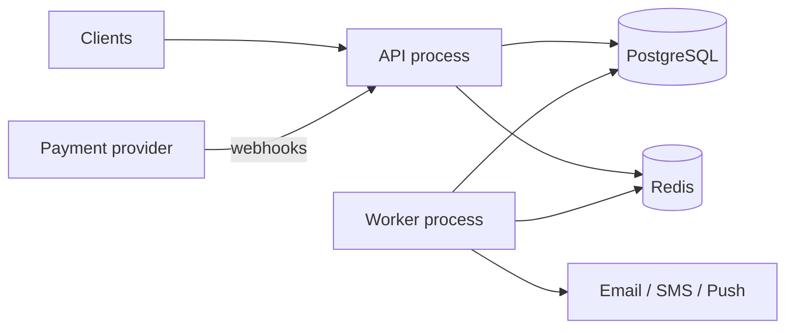

# Fundra — Case Study

> The story of Fundra: the problem, the architecture chosen, the technologies, the challenges met, the trade-offs made and what comes next. Written for portfolio readers, reviewers and interviewers. Technical detail lives in [ARCHITECTURE.md](ARCHITECTURE.md); scope lives in [PROJECT.md](PROJECT.md).

**Stage at time of writing (2026-10-01):** requirements and architecture are complete, dependencies and tooling are set up, and the module structure is scaffolded. Application code so far covers only validated configuration and redacted logging (see [ROADMAP.md](ROADMAP.md)). This case study will be extended as each module is built. Every claim below about the repository reflects its actual state on that date.

---

## 1. The problem

Most backend portfolio projects are CRUD applications: a request comes in, a row changes, a response goes out. Mistakes there are cheap. A wrong value can be fixed with an update.

Money doesn't work like that. A financial backend has to answer harder questions:

- **What happens when two requests spend the same balance at the same moment?** Without care, both succeed and the wallet goes negative.
- **What happens when a client times out and retries a transfer?** Without care, the user is charged twice.
- **What happens when the server crashes halfway through a transfer?** The sender must never be debited without the recipient being credited.
- **What happens when a payment provider sends the same webhook three times?** The deposit must be credited exactly once.
- **Why is this balance ₦42,150?** The system must be able to show its working.

Fundra is a backend for a fictional NGN digital-wallet platform, built to answer these questions properly. Users register, complete KYC, fund a wallet, transfer money, make payments and withdraw. The point is not the features; it is that **each one stays correct under retries, concurrency and partial failure.**

---

## 2. The central idea: a ledger, not a balance column

The naive design stores `balance` on a wallet and changes it. That approach can't explain itself. After a bug, nothing tells you what the balance *should* be.

Fundra uses **double-entry accounting**. Every movement of money is a transaction made of ledger entries whose debits and credits are equal. Balances are derived from those entries. The wallet's balance column is only a cache of the ledger, and a reconciliation job checks that cache against the ledger.

A detail that is easy to miss: a deposit can't credit a wallet "from nowhere". The other side of the entry has to be a real account. Fundra models **system accounts**:

- provider settlement (money held at the payment provider)
- fee revenue
- a suspense account for money that can't yet be attributed

From the platform's point of view, a user's balance is a **liability**: money Fundra owes them. Getting that framing right is what makes deposits, withdrawals and fees balance naturally (see [ARCHITECTURE.md §7](ARCHITECTURE.md#7-financial-core--designed)).

Entries are **immutable**. A refund or reversal is a new, opposite posting linked to the original, never an edit. The database enforces this with triggers, not just application code. That way the rule still holds if the application has a bug.

---

## 3. Architecture

Fundra is a **modular monolith**: one codebase with 13 feature modules (auth, users, KYC, wallets, ledger, transactions, transfers, payments, webhooks, beneficiaries, notifications, audit, admin). It runs as two processes:

- an **API process** for HTTP
- a **worker process** for background jobs

**Why not microservices:** the most important guarantee is that a transfer's ledger entries, balance updates, audit record and notification intent commit **together or not at all**. In a monolith, that's a single PostgreSQL transaction. Across services, it would need sagas, compensation and distributed tracing. That's a large cost for no benefit at this scale. Strict module boundaries (services only, no reaching into another module's tables) keep a later split possible.

**Layering:** routes → controller → service → Prisma. Only one service, `ledger.service`, may write ledger entries or change balances. That gives the core financial rule a single choke point that can be tested.

---

## 4. Technologies and why

| Technology | Version | Why it was chosen |
|---|---|---|
| Node.js | 24.21.0 LTS | Spec requires the active LTS. Node 26 exists but isn't LTS until late October 2026 |
| TypeScript | 6.0.3 | Strict typing for money and state machines. Held below 7.x for ESLint compatibility (see §5) |
| Express | 5.2.1 | Spec'd framework; v5 forwards rejected promises from async handlers to error middleware |
| PostgreSQL | not yet installed | ACID transactions, row-level locking, constraints and triggers to enforce ledger rules |
| Prisma | 7.10.0 | Typed queries and migrations; v7 connects through the `@prisma/adapter-pg` driver adapter |
| Zod | 4.6.5 | Runtime validation that also produces TypeScript types and OpenAPI schemas |
| jose | 6.2.12 | JWTs; actively maintained, ships its own types, no dependencies |
| argon2 | 0.45.1 | Argon2id, the current recommended password hashing algorithm |
| ioredis + BullMQ | 6.0.0 / 6.3.11 | Rate limits, OTPs and durable job queues with retries |
| Pino | 10.3.1 | Fast structured JSON logs with built-in redaction of secrets |
| helmet + cors | 8.3.0 / 2.8.6 | Security headers and an origin allow-list |

---

## 5. Challenges so far

### 5.1 "Latest" isn't always stable

The spec says to use the latest stable versions and to check them against the registry rather than relying on memory. Doing that turned up three traps that a plain `npm install <pkg>` would have fallen into:

- **Prisma's `latest` tag points to a release candidate.** On the install date, `npm view prisma version` returned `8.0.0-rc.19`, while `@prisma/client`'s `latest` was `7.10.0`. The command-line tool and client must match, so both were pinned to 7.10.0.
- **The newest TypeScript breaks the linter.** TypeScript 7.0.2 is the stable `latest`, but `typescript-eslint` declares support for `typescript >=4.8.4 <6.1.0`. The spec requires ESLint, so TypeScript was held at 6.0.3.
- **`@types/node` must match the runtime, not the newest version.** Types for Node 26 would let code compile against APIs that Node 24 doesn't have. They were pinned to v24.

*Principle:* "latest" is a property of a registry tag, not a guarantee. Check the release tags and peer dependency ranges, not just the version number.

### 5.2 Install scripts are now opt-in

npm 11 skips package install scripts unless they're explicitly approved. Without approval, argon2's native binary and Prisma's engines never install. The install appears to succeed, then fails at runtime. Only the four packages that need scripts were approved (argon2, prisma, @prisma/engines, msgpackr-extract). Each was then smoke-tested: an Argon2id hash and verify, a JWT sign and verify, and Prisma's engine loading. A green `npm install` was not treated as proof.

### 5.3 Audit findings in development tools

`npm audit` reports 4 high-severity advisories, all inside the `prisma` development tool (through `mysql2` and `deepmerge-ts`). npm's only proposed fix is a major **downgrade** to Prisma 6. None of this code runs in the API, so the advisories are documented rather than "fixed" by a downgrade that would cost more than the risk.

### 5.4 Running TypeScript without a build tool

Node 24 runs `.ts` files directly by stripping type annotations. That removes the usual dev-time dependency (`tsx`, `ts-node`, `nodemon`), and `node --watch --env-file-if-exists=.env` covers auto-restart and env loading. The catch is that Node resolves imports literally: `import './x.js'` fails when only `x.ts` exists. The fix is to write imports with `.ts` extensions and let TypeScript rewrite them to `.js` at build time (`allowImportingTsExtensions` + `rewriteRelativeImportExtensions`). `erasableSyntaxOnly` makes the compiler reject syntax that can't simply be stripped, such as `enum`, so code that type-checks is guaranteed to run unmodified. This was checked with a probe module run three ways: from source, after `tsc`, and from `dist/`.

### 5.5 Prisma 7 and a database that wasn't ours

Three things surfaced while wiring up Prisma 7:

- **Code generation shouldn't need a database.** The documented pattern, `url: env('DATABASE_URL')` in `prisma.config.ts`, throws when the variable is missing, so `prisma generate` fails too. That breaks CI and Docker builds, which generate the client long before a database exists. The datasource is now only configured when the URL is present: `generate` always works, and `migrate` still fails with Prisma's own clear message.
- **No `dotenv` needed.** Prisma 7 stopped loading `.env`, and the docs suggest adding `dotenv`. Node's built-in `process.loadEnvFile()` does the same job without a dependency.
- **"Authentication failed" from a database that shouldn't exist.** Before Docker was even installed, `prisma migrate status` reached *something* on port 5432. It turned out to be a native PostgreSQL **16** Windows service. It would have blocked the Docker container's port, and it's too old for the design (`uuidv7()` is new in PostgreSQL 18). Fundra's container moved to port 5433 rather than touching a service other projects may rely on.

*Principle:* an unexpected success, such as a connection that shouldn't work, deserves the same investigation as a failure.

### 5.6 Testing a migration without a database server

A 700-line migration that has never run is a liability, and Docker wasn't installed yet. Two tools closed the gap without adding project dependencies:

- `prisma migrate diff --from-empty --to-schema` produces the migration SQL with no database connection.
- **PGlite**, PostgreSQL compiled to WebAssembly and installed in a scratch folder, turned out to be **PostgreSQL 18.3**, the same major version as the Docker image, so even `uuidv7()` worked natively.

A script applied the migration and tried to break every rule. The first run reported 2 failures, but both bad inserts had been rejected, just by a different constraint than the test intended (for example, a negative balance also violates `0 ≤ available ≤ ledger`, which fires first). Rewriting each test so only one rule could possibly fire turned a vague "it was rejected" into "rejected by exactly the constraint meant to catch it", for all 30 cases.

*Principle:* a constraint test should assert *which* rule rejected the data. Otherwise a test can pass because a different rule happened to catch the problem, and the rule it claims to test may not work at all.

### 5.7 Design challenges solved on paper

These are designed in [ARCHITECTURE.md](ARCHITECTURE.md) and will be proven by tests as they are built:

- **Concurrent debits.** A transaction alone doesn't stop two transfers from both passing a balance check. Wallets are locked with `SELECT … FOR UPDATE` in ascending ID order (which avoids deadlocks), and the balance is checked *after* the lock. Prisma has no API for row locks, so the ledger is the one module with a raw-SQL repository.
- **Idempotency location.** The brief places idempotency keys in Redis. A key stored in Redis and money moved in PostgreSQL can disagree after a crash. The idempotency record is therefore a PostgreSQL row with a unique constraint, written in the same transaction as the money movement. It stores the request hash, so a reused key with a different body is rejected, and the response, so retries get the identical answer.
- **Notifications that survive crashes.** "Commit, then enqueue" loses messages if the process dies in between. A transactional outbox writes the event inside the business transaction, and a relay publishes it to BullMQ.
- **Webhook signatures.** HMAC signatures are computed over the raw request bytes. A global `express.json()` would destroy them. The webhook router is mounted before body parsing.
- **Withdrawals that might fail.** Funds must be unavailable while the provider processes a payout, but not yet posted. *Holds* reduce the available balance without touching the ledger balance. They are then settled or released by the webhook.

---

## 6. Trade-offs

| Decision | Gained | Given up |
|---|---|---|
| Modular monolith over microservices | Single-transaction atomicity, simple deployment, easy local development | Independent scaling and deployment of modules |
| `BIGINT` kobo over `DECIMAL` / floats | Exact arithmetic; fractions of a kobo can't be stored | Every amount must be converted at the API boundary; JSON needs strings |
| Idempotency in PostgreSQL, not Redis | Same transactional guarantee as the money movement | A database round trip per request (Redis is still used as an optional lock) |
| Transactional outbox | No lost or phantom notifications | An extra table and a relay job; delivery becomes at-least-once, so handlers must be idempotent |
| Repository layer only for the ledger | Less boilerplate elsewhere | Inconsistent layering between modules, chosen on purpose |
| Pessimistic row locks | Simple, provably correct balance checks | Throughput on a single hot wallet is limited by lock contention |
| TypeScript 6 over 7 | Working type-aware linting | The faster TypeScript 7 compiler |
| No `.env.example` | Owner's preference | New contributors can't see the required variables until startup validation tells them |

---

## 7. What to improve next

Immediate (project initialization and configuration):
1. Install Docker and add a `docker-compose.yml` for PostgreSQL and Redis. Nothing that touches data can be tested until this exists.
2. ~~Add `tsconfig.json` (strict), fix the `package.json` `main`/`type` fields, and add `dev`/`build`/`start` scripts.~~ Done. `lint` and `test` scripts arrive with their tools.
3. ~~Configure Prisma 7 (`prisma.config.ts`, datasource, generator).~~ Done in Stage 5 (see §5.5).
4. ~~Install ESLint, Prettier, Vitest and Supertest, so tests are written alongside each module rather than at step 23.~~ Done in Stage 3. Testcontainers follows in Stage 6.
5. ~~Resolve the open decisions D1–D6 before the database design.~~ Done in Stage 1 ([ARCHITECTURE.md §14](ARCHITECTURE.md#14-decisions)).

Later:
- Prove the concurrency design with a parallel-transfer test before building anything on top of the ledger.
- Revisit TypeScript 7 once `typescript-eslint` supports it.
- Re-run `npm audit` after Prisma 7 updates to see whether the development-tool advisories clear.

---

## 8. Results

*To be written as the system is built: test coverage, concurrency test results, measured latencies and a reconciliation report.* No results are claimed until they can be measured.
