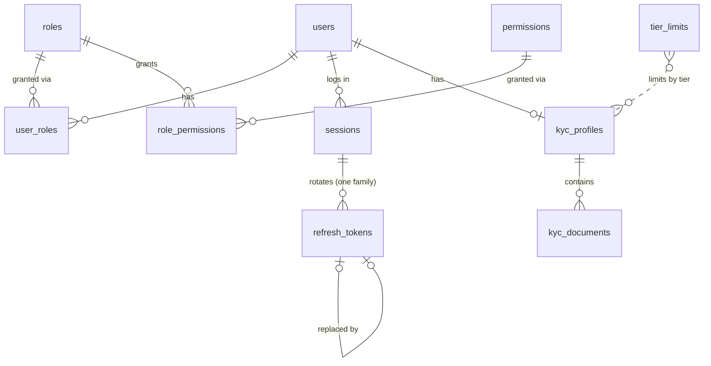
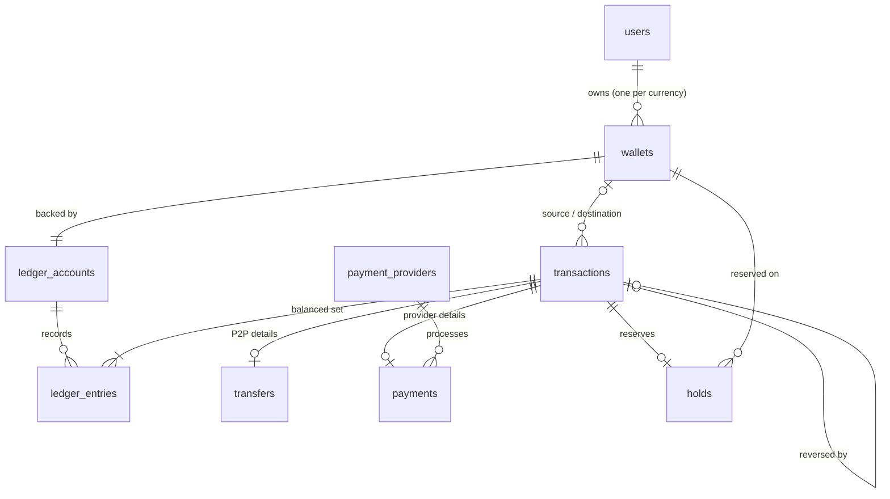
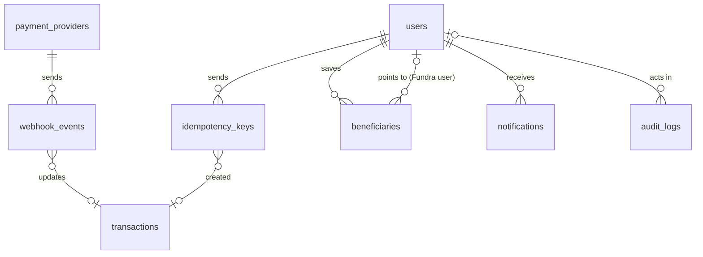

# Fundra — Database Design

> The PostgreSQL schema: every table, column, key, index and constraint, and why it exists. Written for developers implementing the Prisma schema and migrations (Stage 5) and for reviewers checking the financial model. The ledger concepts behind it are in [ARCHITECTURE.md §7](ARCHITECTURE.md#7-financial-core--designed).

**Status: Implemented as schema + migration (2026-10-01).** All 26 tables are in [prisma/schema.prisma](../prisma/schema.prisma) and the first migration (`prisma/migrations/*_init`). The ledger integrity triggers are in a second migration (`*_ledger_integrity_triggers`), a third (`*_append_only_error_code`) gives append-only violations their own SQLSTATE, and a fourth (`*_idempotency_claimed_at`) adds the idempotency fencing column. All four were verified on PostgreSQL 18.3 (PGlite), not yet on the Docker database.

**Schema ↔ migrations drift check (2026-10-02): zero drift.** `prisma migrate diff --from-config-datasource --to-schema` against a database with all migrations applied reports an empty migration. The first run of this check found that PostgreSQL stores the partial-index predicate `status IN (...)` as `status = ANY (ARRAY[...])`, which made Prisma want to drop and recreate `transactions_in_flight_idx` in **every** future migration. The schema now writes the predicate in PostgreSQL's stored form.

---

## 1. Conventions

| Topic | Rule | Why |
|---|---|---|
| Database | PostgreSQL 18 (`postgres:18.6-alpine`) | Matches `docker-compose.yml` |
| Primary keys | `uuid`, default `uuidv7()` (built into PostgreSQL 18) | Time-ordered (good index locality), not guessable (no enumeration), and generated by the database, so raw-SQL inserts get IDs too |
| Naming | Tables plural `snake_case`; columns `snake_case`; Prisma models `PascalCase` with `@@map` / `@map` | Idiomatic in both SQL and TypeScript |
| Money | `bigint` minor units (kobo), always paired with `currency char(3)` | D1; exact integer arithmetic. Every money column holds kobo |
| Timestamps | `timestamptz(3)`; `created_at` on every table, `updated_at` where rows change | Time-zone safe; millisecond precision matches JavaScript `Date` |
| Business day | `Africa/Lagos` (WAT, UTC+1) for daily limits | NGN users' calendar day, not UTC's |
| Emails and handles | Stored lower-case, enforced by `CHECK (col = lower(col))` + unique index | Case-insensitive uniqueness without the `citext` extension |
| Enums | PostgreSQL enums via Prisma enums | Invalid states can't be stored |
| Deletes | Users and financial rows are **never** hard-deleted; foreign keys default to `ON DELETE RESTRICT` | Financial records must stay explainable. Deactivation is a status |
| Secrets | Hashes for passwords and tokens; application-level AES-256-GCM for BVN/NIN | A database leak doesn't expose credentials or identity numbers |

**Kept in Redis, not here** (short-lived; safe to lose): email/phone OTPs, password-reset tokens, rate-limit counters, caches. See [ARCHITECTURE.md §9.3](ARCHITECTURE.md#93-postgresql-vs-redis).

---

## 2. Entity overview

26 tables in five groups.

| Group | Tables |
|---|---|
| Identity & access | `users`, `roles`, `permissions`, `role_permissions`, `user_roles`, `sessions`, `refresh_tokens` |
| KYC | `kyc_profiles`, `kyc_documents`, `tier_limits` |
| Money | `ledger_accounts`, `wallets`, `transactions`, `ledger_entries`, `holds`, `transfers`, `fee_rules` |
| Payments & integration | `payment_providers`, `payments`, `webhook_events`, `idempotency_keys`, `outbox_events` |
| Platform | `beneficiaries`, `notifications`, `audit_logs`, `system_settings` |

### 2.1 Identity, access and KYC

### 2.2 Money

### 2.3 Integration and platform

`outbox_events` and `system_settings` have no foreign keys.

---

## 3. Identity and access

### `users`

| Column | Type | Notes |
|---|---|---|
| `id` | uuid PK | |
| `email` | text, unique | Lower-case (`CHECK`) |
| `email_verified_at` | timestamptz null | |
| `phone` | text, unique | E.164, e.g. `+2348012345678` (`CHECK phone ~ '^\+[1-9][0-9]{7,14}$'`) |
| `phone_verified_at` | timestamptz null | |
| `handle` | text, unique | D2: lower-case, `CHECK handle ~ '^[a-z0-9_]{3,20}$'` |
| `first_name`, `last_name` | text | Shown to senders when confirming a recipient |
| `password_hash` | text | Argon2id encoded string |
| `password_changed_at` | timestamptz | Access tokens issued before this are rejected |
| `status` | `user_status` | `PENDING_VERIFICATION` · `ACTIVE` · `SUSPENDED` · `DEACTIVATED` |
| `failed_login_count` | int, default 0 | Lockout after repeated failures |
| `locked_until` | timestamptz null | |
| `preferences` | jsonb, default `{}` | Validated by a Zod schema (notification channels, etc.) |
| `deactivated_at` | timestamptz null | |
| `created_at`, `updated_at` | timestamptz | |

### `roles`, `permissions`, `role_permissions`, `user_roles`

| Table | Columns | Keys |
|---|---|---|
| `roles` | `id`, `name` (`SUPER_ADMIN` · `ADMIN` · `SUPPORT` · `COMPLIANCE` · `FINANCE` · `USER`), `description` | `name` unique |
| `permissions` | `id`, `key` (e.g. `kyc:review`, `transactions:reverse`), `description` | `key` unique, `CHECK key ~ '^[a-z_]+:[a-z_]+$'` |
| `role_permissions` | `role_id`, `permission_id` | PK (`role_id`, `permission_id`); cascade on role/permission delete |
| `user_roles` | `user_id`, `role_id`, `granted_by_user_id` null, `granted_at` | PK (`user_id`, `role_id`) |

D4: admins are users with extra roles. Routes check **permissions**, so changing what a role can do is a data change, not a code change.

### `sessions`

One row per login on a device.

| Column | Type | Notes |
|---|---|---|
| `id` | uuid PK | Carried in the access token (`sid` claim) |
| `user_id` | uuid FK → users | |
| `device_id` | text null | Client-generated stable device identifier |
| `device_name`, `user_agent` | text null | |
| `ip_address` | inet null | At login |
| `last_used_at` | timestamptz | Updated on refresh |
| `expires_at` | timestamptz | Absolute session lifetime |
| `revoked_at` | timestamptz null | Logout, admin action or token reuse |
| `revoke_reason` | text null | `LOGOUT` · `TOKEN_REUSE` · `PASSWORD_CHANGED` · `ADMIN` |
| `created_at` | timestamptz | |

Index: `(user_id) WHERE revoked_at IS NULL`, to list a user's active sessions.

### `refresh_tokens`

A session's tokens form one **family**. Rotation creates a child; presenting an already-used token revokes the session ([ARCHITECTURE.md §6](ARCHITECTURE.md#6-authentication-lifecycle--built-login-refresh-logout)).

| Column | Type | Notes |
|---|---|---|
| `id` | uuid PK | |
| `session_id` | uuid FK → sessions | The family |
| `token_hash` | char(64), unique | SHA-256 hex of the opaque token. The token itself is never stored |
| `replaced_by_id` | uuid null, unique, FK → refresh_tokens | Set on rotation |
| `used_at` | timestamptz null | Set on rotation; a second use means theft |
| `expires_at` | timestamptz | |
| `created_at` | timestamptz | |

Index: `(session_id)`.

SHA-256 is enough here, unlike passwords: the tokens are 256-bit random values, so there is nothing to brute-force.

---

## 4. KYC

### `kyc_profiles`

One per user. Holds the **current** tier and the latest upgrade request; decision history is in `audit_logs`.

| Column | Type | Notes |
|---|---|---|
| `id` | uuid PK | |
| `user_id` | uuid FK, unique | |
| `tier` | smallint, default 0 | Approved tier, `CHECK tier BETWEEN 0 AND 3`. 0 = not verified (no wallet) |
| `status` | `kyc_status` | `NOT_STARTED` · `PENDING` · `IN_REVIEW` · `APPROVED` · `REJECTED` (state of the latest request) |
| `requested_tier` | smallint null | Tier being applied for, `CHECK requested_tier > tier` |
| `date_of_birth` | date null | Tier 1 |
| `address_line1`, `address_line2`, `city`, `state`, `country`, `postal_code` | text null | Tier 3; `country` is ISO 3166-1 alpha-2 |
| `bvn_encrypted`, `nin_encrypted` | bytea null | AES-256-GCM ciphertext (nonce + tag included) |
| `bvn_hmac`, `nin_hmac` | char(64) null, unique | HMAC-SHA-256 of the number: the same BVN can't verify two accounts, and the database never holds it in plain text |
| `provider` | text null | `MOCK` initially (`KycProvider`) |
| `provider_reference` | text null | |
| `submitted_at`, `reviewed_at` | timestamptz null | |
| `reviewed_by_user_id` | uuid null, FK → users | Admin who decided (D4) |
| `rejection_reason` | text null | Shown to the user |
| `created_at`, `updated_at` | timestamptz | |

### `kyc_documents`

| Column | Type | Notes |
|---|---|---|
| `id` | uuid PK | |
| `kyc_profile_id` | uuid FK | |
| `type` | `kyc_document_type` | `NATIONAL_ID` · `PASSPORT` · `DRIVERS_LICENSE` · `VOTERS_CARD` · `UTILITY_BILL` · `SELFIE` |
| `storage_key` | text, unique | Object-storage key (local disk now, S3 later). Never a public URL |
| `mime_type` | text | Allow-listed: `image/jpeg`, `image/png`, `application/pdf` |
| `size_bytes` | int | `CHECK size_bytes > 0` |
| `sha256` | char(64) | Integrity and duplicate detection |
| `status` | `kyc_document_status` | `PENDING` · `ACCEPTED` · `REJECTED` |
| `uploaded_at`, `reviewed_at` | timestamptz | |

Index: `(kyc_profile_id)`.

### `tier_limits`

D3 limits as data, seeded and editable by admins.

| Column | Type | Notes |
|---|---|---|
| `tier` | smallint | PK part, 1–3 |
| `currency` | char(3) | PK part |
| `per_transaction_limit` | bigint | kobo |
| `daily_outflow_limit` | bigint | kobo, per `Africa/Lagos` day |
| `max_balance` | bigint null | kobo; `NULL` = unlimited |
| `updated_at` | timestamptz | |

`CHECK` all limits > 0 and `per_transaction_limit <= daily_outflow_limit`.

---

## 5. Money

### `ledger_accounts`

| Column | Type | Notes |
|---|---|---|
| `id` | uuid PK | |
| `code` | text, unique | `WALLET:<wallet_id>`, `PROVIDER_SETTLEMENT:<PROVIDER>:<CCY>`, `FEE_REVENUE:<CCY>`, `SUSPENSE:<CCY>` |
| `type` | `ledger_account_type` | `ASSET` · `LIABILITY` · `REVENUE` · `EXPENSE`; the normal balance side follows from this |
| `currency` | char(3) | |
| `created_at` | timestamptz | |

Unique `(id, currency)`, the target of the composite foreign keys below.

**No balance column here, on purpose.** Caching balances on system accounts would make every transfer lock the single `FEE_REVENUE` row, a hot row that serializes all transfers. System balances are computed with `SUM` when needed. Only wallets cache balances, because only wallets need fast balance checks.

### `wallets`

| Column | Type | Notes |
|---|---|---|
| `id` | uuid PK | |
| `user_id` | uuid FK | |
| `currency` | char(3) | |
| `account_number` | char(10), unique | D2: generated with a check digit; `CHECK account_number ~ '^[0-9]{10}$'` |
| `ledger_account_id` | uuid, unique | Composite FK (`ledger_account_id`, `currency`) → ledger_accounts (`id`, `currency`), so the wallet and its ledger account can't disagree on currency |
| `status` | `wallet_status` | `ACTIVE` · `FROZEN` · `CLOSED` |
| `ledger_balance` | bigint, default 0 | Cache of Σ posted entries |
| `available_balance` | bigint, default 0 | `ledger_balance` − active holds |
| `created_at`, `updated_at` | timestamptz | |

Unique `(user_id, currency)`. `CHECK ledger_balance >= 0`, `CHECK available_balance >= 0 AND available_balance <= ledger_balance`. These checks are the **last line of defence against overdraft**: even a buggy service can't commit a negative wallet.

### `transactions`

The business record. Ledger entries reference it.

| Column | Type | Notes |
|---|---|---|
| `id` | uuid PK | |
| `reference` | text, unique | `CHECK reference ~ '^FND-TRX-[0-9]{8}-[0-9A-F]{6}$'` |
| `type` | `transaction_type` | `DEPOSIT` · `WITHDRAWAL` · `TRANSFER` · `PAYMENT` · `REFUND` · `FEE` · `REVERSAL` |
| `status` | `transaction_status` | `PENDING` · `PROCESSING` · `COMPLETED` · `FAILED` · `REVERSED` · `CANCELLED` |
| `currency` | char(3) | |
| `amount` | bigint | Principal, `CHECK amount > 0` |
| `fee` | bigint, default 0 | `CHECK fee >= 0` (D6) |
| `source_wallet_id` | uuid null, FK → wallets | Debited wallet (null for deposits) |
| `destination_wallet_id` | uuid null, FK → wallets | Credited wallet (null for withdrawals) |
| `initiated_by_user_id` | uuid null, FK → users | Null for system/webhook-initiated |
| `reversal_of_id` | uuid null, unique, FK → transactions | A transaction can be reversed at most once |
| `description` | text null | User-supplied narration, max 140 chars |
| `failure_reason` | text null | |
| `metadata` | jsonb, default `{}` | |
| `completed_at` | timestamptz null | `CHECK status NOT IN ('COMPLETED','REVERSED') OR completed_at IS NOT NULL` |
| `created_at`, `updated_at` | timestamptz | |

Unique `(id, currency)`, the target for ledger entries.
`CHECK source_wallet_id IS NOT NULL OR destination_wallet_id IS NOT NULL`, and the two must differ.

Indexes:
- `(source_wallet_id, created_at DESC, id DESC)` and `(destination_wallet_id, created_at DESC, id DESC)`: a wallet's history, cursor-paginated, **including pending items** that have no ledger entries yet.
- `(status, created_at) WHERE status IN ('PENDING','PROCESSING')`: finding stuck transactions for reconciliation.

### `ledger_entries`

Append-only, the financial source of truth.

| Column | Type | Notes |
|---|---|---|
| `id` | uuid PK | |
| `transaction_id` | uuid | Composite FK (`transaction_id`, `currency`) → transactions (`id`, `currency`) |
| `ledger_account_id` | uuid | Composite FK (`ledger_account_id`, `currency`) → ledger_accounts (`id`, `currency`) |
| `direction` | `entry_direction` | `DEBIT` · `CREDIT` |
| `amount` | bigint | `CHECK amount > 0` |
| `currency` | char(3) | |
| `balance_after` | bigint null | The wallet's ledger balance after this entry. Set for wallet accounts (which are locked when posting); null for system accounts (never locked) |
| `created_at` | timestamptz | |

The two composite foreign keys enforce **invariant 2** (one currency per transaction) declaratively: an entry's currency must equal both its transaction's and its account's.

Indexes:
- `(transaction_id)`: load a transaction's entries.
- `(ledger_account_id, created_at, id)`: statements, the daily-outflow sum for limits, and reconciliation.

### `holds`

| Column | Type | Notes |
|---|---|---|
| `id` | uuid PK | |
| `wallet_id` | uuid FK | |
| `transaction_id` | uuid FK, unique | One hold per transaction |
| `amount` | bigint | `CHECK amount > 0` |
| `status` | `hold_status` | `ACTIVE` · `SETTLED` · `RELEASED` |
| `expires_at` | timestamptz null | Safety net: reconciliation releases expired holds |
| `created_at` | timestamptz | |
| `resolved_at` | timestamptz null | `CHECK (status = 'ACTIVE') = (resolved_at IS NULL)` |

Index: `(wallet_id) WHERE status = 'ACTIVE'`.

### `transfers`

P2P details. One-to-one with a `TRANSFER` transaction.

| Column | Type | Notes |
|---|---|---|
| `transaction_id` | uuid PK, FK → transactions | |
| `recipient_lookup` | `recipient_lookup_type` | `HANDLE` · `ACCOUNT_NUMBER`: how the sender identified the recipient (D2) |
| `recipient_lookup_value` | text | The handle or account number as entered (normalized) |
| `beneficiary_id` | uuid null, FK → beneficiaries | If sent from a saved beneficiary |

The wallets involved are `transactions.source_wallet_id` / `destination_wallet_id`; they aren't duplicated here.

### `fee_rules`

D6 fee schedule as data.

| Column | Type | Notes |
|---|---|---|
| `id` | uuid PK | |
| `transaction_type` | `transaction_type` | |
| `currency` | char(3) | |
| `flat_fee` | bigint, default 0 | kobo |
| `percentage_bps` | int, default 0 | Basis points (1 bp = 0.01%), so the fee is computed in integers |
| `min_fee`, `max_fee` | bigint null | kobo caps |
| `effective_from` | timestamptz | |
| `is_active` | boolean | |

Partial unique index `(transaction_type, currency) WHERE is_active`: at most one active rule per type and currency. Seeded with ₦0 for `TRANSFER`.

---

## 6. Payments and integration

### `payment_providers`

| Column | Type | Notes |
|---|---|---|
| `id` | uuid PK | |
| `code` | text, unique | `MOCK`, later `PAYSTACK`, `FLUTTERWAVE` |
| `name` | text | |
| `is_active` | boolean | |
| `created_at` | timestamptz | |

API keys and webhook secrets live in environment variables, **never** in the database.

### `payments`

Provider details for `DEPOSIT`, `WITHDRAWAL` and `PAYMENT` transactions.

| Column | Type | Notes |
|---|---|---|
| `transaction_id` | uuid PK, FK → transactions | |
| `provider_id` | uuid FK | |
| `direction` | `payment_direction` | `INBOUND` (deposit) · `OUTBOUND` (withdrawal, payment) |
| `provider_reference` | text null | Provider's ID for the payment |
| `provider_status` | text null | Raw provider status, for support |
| `checkout_url` | text null | Deposits |
| `bank_code`, `bank_account_number`, `bank_account_name` | text null | Withdrawal destination |
| `metadata` | jsonb, default `{}` | |
| `created_at`, `updated_at` | timestamptz | |

Unique `(provider_id, provider_reference)`: a provider's payment maps to exactly one Fundra transaction.

### `webhook_events`

| Column | Type | Notes |
|---|---|---|
| `id` | uuid PK | |
| `provider_id` | uuid FK | |
| `event_id` | text | Provider's event ID |
| `event_type` | text | |
| `payload` | jsonb | Stored only after signature verification |
| `status` | `webhook_status` | `RECEIVED` · `PROCESSED` · `FAILED` · `IGNORED` |
| `attempts` | int, default 0 | |
| `last_error` | text null | |
| `transaction_id` | uuid null, FK | Once matched |
| `received_at`, `processed_at` | timestamptz | |

Unique `(provider_id, event_id)`: **the** deduplication guarantee. A replayed webhook fails to insert and is acknowledged as a no-op.

### `idempotency_keys`

| Column | Type | Notes |
|---|---|---|
| `id` | uuid PK | |
| `user_id` | uuid FK | |
| `key` | text | Client's `Idempotency-Key`, `CHECK length(key) BETWEEN 8 AND 255` |
| `request_hash` | char(64) | SHA-256 of method + path + canonical body; same key with a different hash → 422 |
| `status` | `idempotency_status` | `IN_PROGRESS` · `COMPLETED` |
| `response_status` | int null | |
| `response_body` | jsonb null | Replayed on retry (same values; `jsonb` may reorder object keys) |
| `transaction_id` | uuid null, FK | |
| `claimed_at` | timestamptz | When the current owner claimed the key. **Fencing token** for stale-claim takeover (migration `*_idempotency_claimed_at`) |
| `created_at` | timestamptz | |
| `expires_at` | timestamptz | 24 h; expired keys are purged |

Unique `(user_id, key)` is the claim lock. The row is marked `COMPLETED` **in the same DB transaction** as the money movement ([ARCHITECTURE.md §9.3](ARCHITECTURE.md#93-postgresql-vs-redis)); the full algorithm is in [ARCHITECTURE.md, Idempotency](ARCHITECTURE.md#idempotency-built).

### `outbox_events`

| Column | Type | Notes |
|---|---|---|
| `id` | uuid PK | Also the job ID, so consumers can deduplicate |
| `event_type` | text | e.g. `transfer.completed` |
| `aggregate_type`, `aggregate_id` | text, uuid | What the event is about |
| `payload` | jsonb | |
| `attempts` | int, default 0 | |
| `created_at` | timestamptz | |
| `published_at` | timestamptz null | Set by the outbox relay |

Index: `(created_at) WHERE published_at IS NULL`, so the relay only scans unpublished rows.

---

## 7. Platform

### `beneficiaries`

| Column | Type | Notes |
|---|---|---|
| `id` | uuid PK | |
| `user_id` | uuid FK | Owner |
| `type` | `beneficiary_type` | `FUNDRA_WALLET` · `BANK_ACCOUNT` |
| `recipient_wallet_id` | uuid null, FK → wallets | Fundra recipient |
| `bank_code`, `bank_account_number`, `bank_account_name` | text null | Bank recipient |
| `nickname` | text null | |
| `last_used_at` | timestamptz null | |
| `created_at`, `updated_at` | timestamptz | |

- `CHECK` ensures the type's fields are present: `FUNDRA_WALLET` needs `recipient_wallet_id`; `BANK_ACCOUNT` needs all bank fields.
- Partial unique indexes stop duplicates: `(user_id, recipient_wallet_id) WHERE type = 'FUNDRA_WALLET'`, and `(user_id, bank_code, bank_account_number) WHERE type = 'BANK_ACCOUNT'`.

### `notifications`

| Column | Type | Notes |
|---|---|---|
| `id` | uuid PK | |
| `user_id` | uuid FK | |
| `channel` | `notification_channel` | `EMAIL` · `SMS` · `PUSH` · `IN_APP` |
| `type` | text | e.g. `transfer.received` |
| `title`, `body` | text | |
| `data` | jsonb, default `{}` | No secrets, no full account numbers |
| `status` | `notification_status` | `PENDING` · `SENT` · `FAILED` |
| `read_at`, `sent_at` | timestamptz null | |
| `created_at` | timestamptz | |

Index: `(user_id, created_at DESC)`.

### `audit_logs`

Append-only (database trigger).

| Column | Type | Notes |
|---|---|---|
| `id` | uuid PK | |
| `actor_type` | `actor_type` | `USER` · `ADMIN` · `SYSTEM` |
| `actor_user_id` | uuid null, FK → users | |
| `action` | text | e.g. `kyc.approved`, `transfer.created`, `auth.login_failed` |
| `resource_type` | text null | |
| `resource_id` | text null | |
| `ip_address` | inet null | |
| `user_agent` | text null | |
| `request_id` | text null | Links to the request's log lines |
| `metadata` | jsonb, default `{}` | Never passwords, tokens, OTPs or full identity numbers |
| `created_at` | timestamptz | |

Indexes: `(resource_type, resource_id, created_at)`, `(actor_user_id, created_at)`, `(action, created_at)`.

### `system_settings`

| Column | Type | Notes |
|---|---|---|
| `key` | text PK | e.g. `transfers.enabled`, `maintenance_mode` |
| `value` | jsonb | Each key validated by a Zod schema in code |
| `updated_by_user_id` | uuid null, FK | |
| `updated_at` | timestamptz | |

Tier limits and fees have their own typed tables; this is for simple switches.

---

## 8. Integrity rules enforced by the database

The application checks all of these first, so it can return clear errors. The database enforces them anyway, so a bug can't commit bad data.

| # | Rule | Mechanism |
|---|---|---|
| 1 | A transaction's entries balance (Σ debits = Σ credits) | `DEFERRABLE INITIALLY DEFERRED` constraint trigger on `ledger_entries`, checked at commit |
| 2 | One currency per transaction | Composite FKs on `ledger_entries` |
| 3 | Ledger entries are immutable | Trigger rejecting `UPDATE` / `DELETE` on `ledger_entries` |
| 4 | Audit logs are immutable | Same trigger on `audit_logs` |
| 5 | Positive amounts; direction carries the sign | `CHECK amount > 0` |
| 6 | Wallets never go negative or over-reserve | `CHECK` on `wallets` balances |
| 7 | A wallet and its ledger account share a currency | Composite FK on `wallets` |
| 8 | A transaction is reversed at most once | Unique `reversal_of_id` |
| 9 | Webhooks processed at most once | Unique `(provider_id, event_id)` |
| 10 | Retries can't duplicate money movement | Unique `(user_id, key)` on `idempotency_keys` |
| 11 | One BVN/NIN per verified identity | Unique `bvn_hmac` / `nin_hmac` |
| 12 | Valid formats (handles, phones, references, account numbers) | `CHECK` regexes |

Where each rule lives:
- **Partial indexes** are declared in `schema.prisma` with Prisma's `partialIndexes` preview feature, so later migrations keep them.
- **CHECK constraints** (41) can't be expressed in Prisma's schema language. They are hand-written SQL at the end of the init migration.
- **Rules 1, 3 and 4** are triggers in the `*_ledger_integrity_triggers` migration:

  | Trigger | Fires | Effect |
  |---|---|---|
  | `ledger_entries_balanced` | `AFTER INSERT`, constraint trigger, `DEFERRABLE INITIALLY DEFERRED` | At COMMIT, recomputes Σ debits and Σ credits for each touched transaction. A mismatch raises `23514 check_violation` with constraint `ledger_entries_balanced`, and the whole commit rolls back |
  | `ledger_entries_append_only`, `audit_logs_append_only` | `BEFORE UPDATE OR DELETE`, per row | Raise SQLSTATE **`FN001`** (Fundra-reserved), message `<table> is append-only: <op> is not allowed` |
  | `ledger_entries_no_truncate`, `audit_logs_no_truncate` | `BEFORE TRUNCATE`, per statement | Same; `TRUNCATE` skips row triggers, so it needs its own |

  Why deferred: entries are inserted one at a time, so mid-transaction the books are legitimately unbalanced. Checking at COMMIT allows that but never allows *committing* them. Application code must therefore never run `SET CONSTRAINTS ALL IMMEDIATE`. A balance failure surfaces when the transaction **commits**, so the ledger service must handle errors from the commit itself (Stage 11).

  **Why `FN001` and not a standard code.** The triggers first raised `23001 restrict_violation`. Testing through Prisma showed its `pg` adapter maps `23001` to `P2003` "Foreign key constraint violated". The edit *was* blocked, but the error claimed a non-existent foreign-key problem and was indistinguishable from a real one. Codes outside the adapter's mapping table pass through with their original code and message, so append-only violations now use a Fundra-reserved class (migration `*_append_only_error_code`). Through Prisma they surface as `P2039` with `meta.driverAdapterError.cause.originalCode === 'FN001'`; a real foreign-key violation is still `P2003`. The balance check's standard `23514` isn't remapped by the adapter, so it is unchanged.

  | SQLSTATE | Meaning | Raised by |
  |---|---|---|
  | `FN001` | Append-only table modified | `ledger_entries`, `audit_logs` triggers |
  | `23514` (constraint `ledger_entries_balanced`) | Unbalanced ledger transaction at COMMIT | `ledger_entries_balanced` |

  Limits: triggers stop application bugs, not a database superuser, who can disable them. Running the app as a non-owner role without `TRUNCATE`/`ALTER` rights closes that gap (Stage 25).

**Verification (2026-10-01).** The init migration was applied to PostgreSQL 18.3 running in-process (PGlite), since Docker wasn't available yet. The catalogue held exactly 26 tables, 41 checks, 34 foreign keys and 7 partial indexes. 30 checks then confirmed that valid data is accepted, and that each bad insert is rejected by the specific constraint meant to stop it: overdraft, currency mismatch on the composite keys, duplicate webhook, reused idempotency key, double reversal, two active fee rules, and so on. A second script then attacked the triggers with **real commits** (19/19 passing):
- Balanced 2-leg, 3-leg (with fee) and reversal postings commit.
- An intermediate unbalanced state is accepted as long as it's balanced by COMMIT.
- Rejected: debits ≠ credits; a single-leg entry ("money from nowhere"); a later commit that unbalances an already-committed transaction; one unbalanced transaction among several in one commit. Rejected commits left no rows behind.
- Rejected: `UPDATE`, `DELETE` and `TRUNCATE` on both append-only tables, and changing a transaction's ID (its `ON UPDATE CASCADE` would rewrite entries).

A mutation test that removed `DEFERRABLE INITIALLY DEFERRED` made every valid posting fail, confirming the tests detect the most dangerous misconfiguration. All 49 checks become permanent integration tests in Stage 6.

---

## 9. Design decisions made here

| Decision | Alternative rejected | Reason |
|---|---|---|
| Names on `users`; DOB, address and identity numbers on `kyc_profiles` | Everything on `users` | Recipient confirmation needs names; identity data is more sensitive and only KYC code should read it |
| Wallet history from `transactions` (source/destination), statements from `ledger_entries` | History from ledger entries only | Pending deposits and withdrawals have no entries yet but must appear in history |
| No cached balance on system ledger accounts | Cache on every account | Avoids a hot `FEE_REVENUE` row that would serialize all transfers |
| `balance_after` on wallet entries | Recompute running balances | Statements and reconciliation become simple reads; it's cheap because the wallet is already locked |
| OTPs and reset tokens in Redis | Database tables | Short-lived and high-churn; losing them only means asking for a new code |
| Upgrade history via `audit_logs` | A `kyc_reviews` table | Avoids a table whose only job is history; audit logs already record every decision |
| Composite foreign keys for currency consistency | Triggers | Declarative, indexed and visible in the schema |
| Fees in basis points | Decimal percentages | Integer-only fee arithmetic (no floats) |

---

## 10. Seed data

`npm run db:seed` runs [prisma/seed.ts](../prisma/seed.ts) in **one database transaction**: either everything applies or nothing does. It's safe to re-run, and it treats the two kinds of data differently:

| Data | Source | On re-run |
|---|---|---|
| 6 roles, 13 permissions, 40 role grants | [src/common/constants/rbac.ts](../src/common/constants/rbac.ts) | **Synced**: descriptions updated; grants not in code are revoked; missing ones are added |
| Payment provider `MOCK` | `prisma/seed.ts` | Synced |
| System ledger accounts: `PROVIDER_SETTLEMENT:MOCK:NGN` (asset), `FEE_REVENUE:NGN` (revenue), `SUSPENSE:NGN` (liability) | `prisma/seed.ts` | Created if missing. If one exists with a **different type or currency, the seed fails** and rolls back rather than altering an account that may carry entries |
| Tier limits (D3, NGN) | `prisma/seed.ts` | **Created only if missing**: admin edits survive |
| Fee rule `TRANSFER` / NGN: ₦0 (D6) | `prisma/seed.ts` | Created only if no **active** rule exists |

**Role → permission mapping** (separation of duties: no role except SUPER_ADMIN can both approve KYC and reverse money):

| Role | Permissions |
|---|---|
| SUPER_ADMIN | All 13, including `roles:assign` and `settings:update` (held only by this role) |
| ADMIN | `users:read/suspend`, `kyc:read`, `wallets:read/freeze`, `transactions:read`, `webhooks:read`, `audit_logs:read`, `settings:read` |
| COMPLIANCE | `users:read/suspend`, `kyc:read/review`, `wallets:read/freeze`, `transactions:read`, `audit_logs:read` |
| FINANCE | `wallets:read`, `transactions:read/reverse`, `webhooks:read`, `audit_logs:read`, `settings:read` |
| SUPPORT | `users:read`, `kyc:read`, `wallets:read`, `transactions:read` (read-only) |
| USER | none (customers act on resources they own) |

**Verification (2026-10-02).** The real seed (real Prisma client and `pg` driver over TCP) ran against PostgreSQL 18.3 with both migrations applied, served by pglite-socket because Docker wasn't available:
- Run 1 created everything; run 2 created no tier limits or fee rules.
- An admin's edit to tier 1 survived a re-seed.
- A hand-granted `kyc:review` on SUPPORT was revoked by a re-seed.
- A conflicting `FEE_REVENUE:NGN` (altered to EXPENSE) made the seed exit 1 with a clear message, and the rogue grant made in the same setup was **still present** afterwards, proving the rollback was atomic.

**Finding:** that last test showed a system ledger account's `type` can be changed with a plain `UPDATE`. On an account that already has entries, that would silently change what its balance means. `code`, `type` and `currency` should become immutable once set (follow-up in Stage 11).
